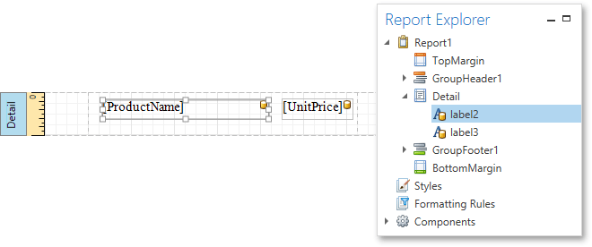
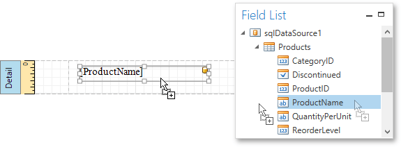
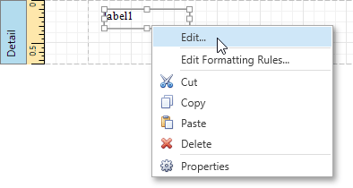
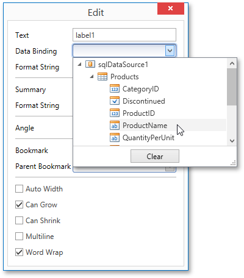
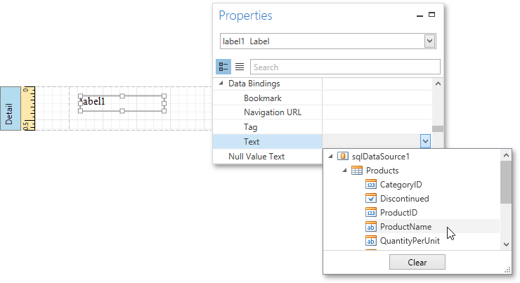

[Report controls](../../../../../../interface-elements-for-desktop/articles/report-designer/report-designer-for-wpf/report-elements/report-controls.md) can either display static information or dynamic data obtained from the [bound data source](../../../../../../interface-elements-for-desktop/articles/report-designer/report-designer-for-wpf/creating-reports/providing-data/binding-a-report-to-data.md).

Data-bound controls are indicated by a yellow database icon, both on the [Design Surface](../../../../../../interface-elements-for-desktop/articles/report-designer/report-designer-for-wpf/interface-elements/design-surface.md) and in the [Report Explorer](../../../../../../interface-elements-for-desktop/articles/report-designer/report-designer-for-wpf/interface-elements/report-explorer.md).

To embed dynamic information to a report, if this information is contained in the report data source, you can use one of the following approaches.
* [Using the Field List](#fieldlist)
* [Using the Context Menu](#contextmenu)
* [Using the Properties Panel](#propertygrid)

After a control is bound to data, you can employ additional features that are listed in the [Special Capabilities](#special) section of this document.

<a name="fieldlist"/>

## Using the Field List
The Report Designer allows you to create a data-aware element using the [Field List](../../../../../../interface-elements-for-desktop/articles/report-designer/report-designer-for-wpf/interface-elements/field-list.md). To do this, switch to the Field List panel, click the desired field item and drop it onto the report band. This automatically creates a control bound to the selected data field.

<a name="contextmenu"/>

## Using the Context Menu
Right click an existing report control, and in the invoked context menu, click the **Edit...** link.
 

In the invoked **Edit** dialog, expand the **Data Binding** drop-down and select the required data field.

To unbind a control's property, expand the **Data Binding** drop-down and click the **Clear** button.

<a name="propertygrid"/>

## Using the Properties Panel
Select a control (e.g., on the [Design Surface](../../../../../../interface-elements-for-desktop/articles/report-designer/report-designer-for-wpf/interface-elements/design-surface.md)) and switch to the [Properties Panel](../../../../../../interface-elements-for-desktop/articles/report-designer/report-designer-for-wpf/interface-elements/properties-panel.md). Expand the **Data Bindings** option and specify a data field for the required property (e.g., **Text**).

To unbind a control's property, expand the corresponding drop-down and click the **Clear** button.

<a name="special"/>

## Special Capabilities
After a control is bound, you can apply formatting to its dynamic content (e.g., for it to be treated as currency, or date-time content). For details on this, refer to [Formatting Data](../../../../../../interface-elements-for-desktop/articles/report-designer/report-designer-for-wpf/creating-reports/shaping-data/formatting-data.md).

It is possible to force a control to display a result of a summary function calculated across the data field to which it is bound. For more information, see [Calculating Summaries](../../../../../../interface-elements-for-desktop/articles/report-designer/report-designer-for-wpf/creating-reports/shaping-data/calculating-summaries.md).

Another noteworthy option is to combine both static and dynamic content within the same control (e.g., to append some text prefix or postfix to a value obtained from a database), or even bind a control to multiple data fields at one time. This is detailed in [Using Mail Merge](../../../../../../interface-elements-for-desktop/articles/report-designer/report-designer-for-wpf/creating-reports/providing-data/using-mail-merge.md).

If you are required to perform pre-calculations over the data field to which a control is bound, you can do so by creating a _calculated field_, and binding the control to it. This is detailed at [Calculated Fields](../../../../../../interface-elements-for-desktop/articles/report-designer/report-designer-for-wpf/creating-reports/providing-data/calculated-fields.md).

In turn, a calculated field may contain both dynamic and static _parameters_, which can be requested each time a report is being previewed. For more information, refer to [Report Parameters](../../../../../../interface-elements-for-desktop/articles/report-designer/report-designer-for-wpf/creating-reports/providing-data/report-parameters.md).