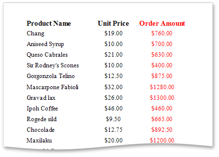

# Calculated Fields
This document demonstrates how to add a _calculated field_ to a report. The main purpose of calculated fields is to perform pre-calculations of virtually any level of complexity over data fields based on a specific expression.

In the Report Designer, a calculated field is similar to an ordinary data field (e.g., you can [bind controls to it](../../../../../../interface-elements-for-desktop/articles/report-designer/report-designer-for-wpf/creating-reports/providing-data/binding-report-controls-to-data.md), and [group](../../../../../../interface-elements-for-desktop/articles/report-designer/report-designer-for-wpf/creating-reports/shaping-data/grouping-data.md), [sort](../../../../../../interface-elements-for-desktop/articles/report-designer/report-designer-for-wpf/creating-reports/shaping-data/sorting-data.md) and [filter](../../../../../../interface-elements-for-desktop/articles/report-designer/report-designer-for-wpf/creating-reports/shaping-data/filtering-data.md) your report against it).

To add a calculated field to your report, follow the instructions below.
1. To create a calculated field, in the [Field List](../../../../../../interface-elements-for-desktop/articles/report-designer/report-designer-for-wpf/interface-elements/field-list.md), right-click any item inside the data source, and in the invoked menu, select **Add Calculated Field**.
	
	
2. In the Field List, select the created field and switch to the [Properties Panel](../../../../../../interface-elements-for-desktop/articles/report-designer/report-designer-for-wpf/interface-elements/properties-panel.md). Make sure to change the **Field Type** property to an appropriate value.
	
	
3. Then, create an expression for the calculated field.
	
	Click the ellipsis button for the **Expression** property to invoke the **Expression Editor**. You can also invoke this dialog by right-clicking the calculated field within the Field List and selecting **Edit Expression...**
	
	
	
	Click **Fields** to see the field list. To add a data field or [report parameter](../../../../../../interface-elements-for-desktop/articles/report-designer/report-designer-for-wpf/creating-reports/providing-data/report-parameters.md) to this expression, double-click the required name. A data field is inserted into the expression's text using its name in **[**square brackets**]**, and parameters are inserted using the "**Parameters.**" prefix before their names. Use the toolbar to add operators between field names.
	
	 
	
	To close the dialog and save the expression, click **OK**.
4. Finally, drag the calculated field from the Field List onto the required [band](../../../../../../interface-elements-for-desktop/articles/report-designer/report-designer-for-wpf/report-elements/report-bands.md) like an ordinary data field.
	
	

The report with a calculated field is now ready. Switch to the [Print Preview](../../../../../../interface-elements-for-desktop/articles/report-designer/report-designer-for-wpf/document-preview.md) tab and view the result.

