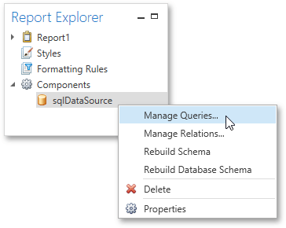
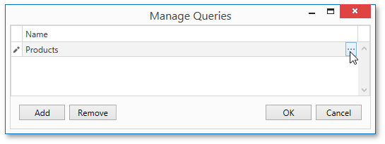
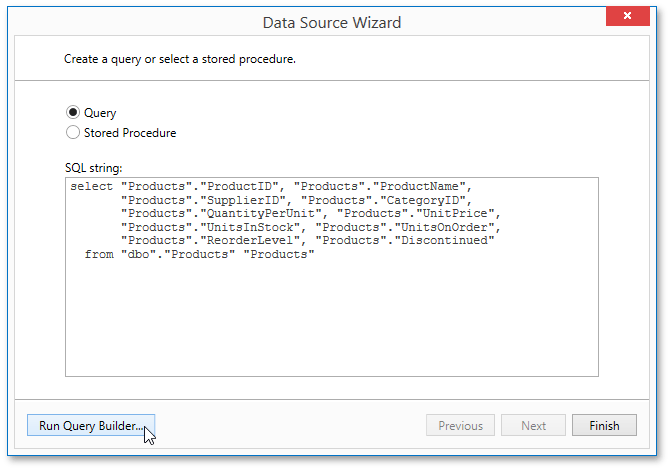
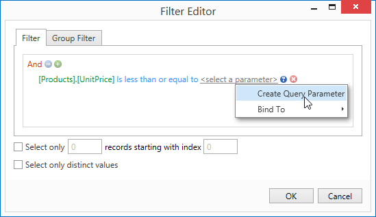
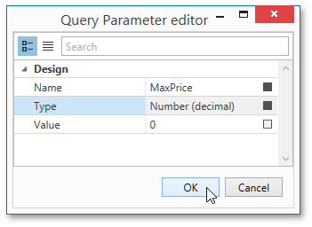
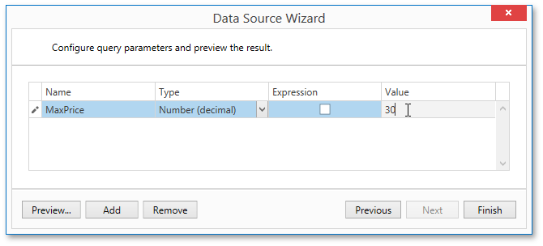
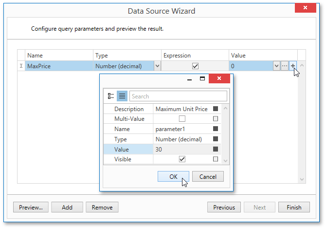
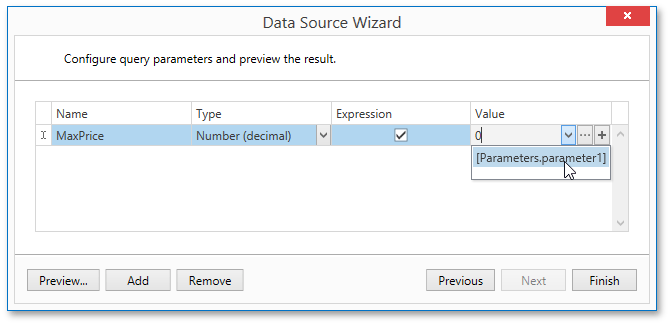

A query parameter holds an external value that is inserted into an SQL statement before query execution. This value can be either static or dynamically generated by an associated expression.

In the Report Designer, query parameters are typically used in the following scenarios.
* Passed as criteria to the **WHERE** part of an SQL statement to perform data source level [filtering](../../../../../../interface-elements-for-desktop/articles/report-designer/report-designer-for-wpf/creating-reports/shaping-data/filtering-data.md). The query parameter's value is inserted into the resulting SQL query string in the position of the corresponding placeholder, which has the "**@QueryParameterName**" form.
* Passed as actual parameters to a stored procedure. See the [Customize the Query](../../../../../../interface-elements-for-desktop/articles/report-designer/report-designer-for-wpf/report-wizard/data-bound-report/connect-to-a-database/customize-the-query.md) topic to learn more.

To create and configure query parameters to filter report data, do the following.
1. When creating a new data-bound report using the [Report Wizard](../../../../../../interface-elements-for-desktop/articles/report-designer/report-designer-for-wpf/report-wizard.md) or [binding an existing one to an SQL data source](../../../../../../interface-elements-for-desktop/articles/report-designer/report-designer-for-wpf/creating-reports/providing-data/binding-a-report-to-data/bind-a-report-to-a-database.md), go to the [query customization](../../../../../../interface-elements-for-desktop/articles/report-designer/report-designer-for-wpf/report-wizard/data-bound-report/connect-to-a-database/customize-the-query.md) page.
	
	To open this page to customize an existing data source, right-click this data source in the [Report Explorer](../../../../../../interface-elements-for-desktop/articles/report-designer/report-designer-for-wpf/interface-elements/report-explorer.md) and select **Manage Queries** in the context menu.
	
	
	
	Then, in the invoked **Manage Queries** dialog, click the ellipsis button for the required query.
	
	
2. In the invoked **Data Source Wizard**, click the **Run Query Builder...** button.
	
	
3. In the **Query Builder**, construct the query, and then, click the **Filter...** button.
	
	
4. In the invoked **Filter Editor**, construct a filtering expression that will be used to filter resulting data at the data source level. To access parameters, click the icon on the right until it turns into a question mark. Then, click the parameter placeholder and select **Create Query Parameter**.
	
	
5. In the invoked **Query Parameter Editor**, specify the parameter's name and appropriate value type, and click **OK**.
	
	
	
	Close the **Filter Editor**, and then, complete the **Query Builder**.
6. Now, the newly constructed SQL query appears in string form on this wizard page. The query parameter is passed to the **WHERE** part of the SQL string and has the "**@QueryParameterName**" form.
	
	
	
	Then, click **Next** to proceed to the next wizard page.
7. The next wizard page provides access to query parameters and allows you to add, configure and remove it. On this page, specify the actual value (either static or dynamic) for a query parameter.
	* **Specifying a static value**
		
		To specify a static value for a query parameter, select the parameter's value type, and then specify its actual value in the **Value** column according to the selected type.
		
		
	* **Specifying a dynamic value**
		
		To use a dynamically generated value, do the following.
		
		First, activate the **Expression** check box for the required parameter. This allows you to use an expression to dynamically calculate the parameter's actual value.
		
		To map the query parameter to a new report parameter, click the plus button for the **Value** property, and in the invoked dialog, specify the required report parameter settings. Be sure to specify the report parameter type according to the type of the respective query parameter.
		
		
		
		Then, expand the drop-down list for the **Value** property and select the created report parameter. This list also contains report parameters that already exist in a report.
		
		
		
		You can also create a complex expression for a query parameter. To do this, click the ellipsis button for the **Value** property and construct the required expression in the invoked **Expression Editor**.
8. Click **Finish** to exit the wizard.