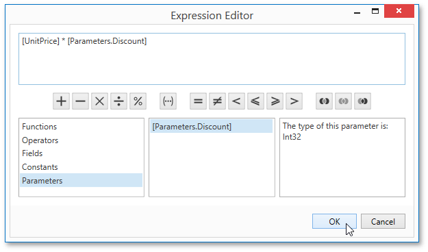
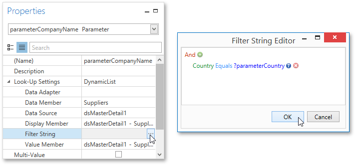
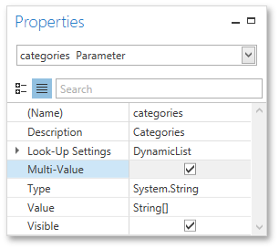
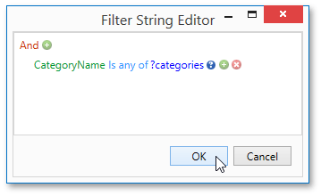
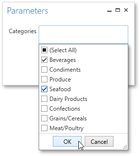
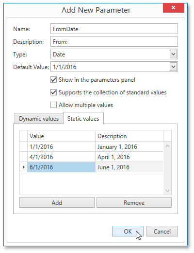
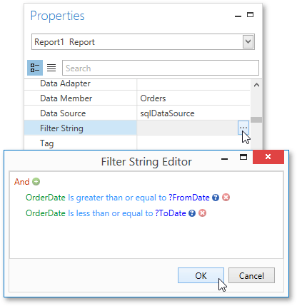

# Report Parameters
This document describes the main concepts of using parameters in the Report Designer and provides information on how to create parameters and pass their values.

The document consists of the following sections.
* [Using Parameters](#using)
* [Creating Parameters](#create)
* [Passing Parameter Values](#result)

<a name="using"/>

## Using Parameters
Report parameters provide the capability to pass data of a certain type to a report and can be used in different ways listed below.
* **Filtering**
	
	You can use a report parameter to filter report data according to the current parameter value by specifying the report's **Filter String**. For more information, see the [Filtering Data](../../../../../../interface-elements-for-desktop/articles/report-designer/report-designer-for-wpf/creating-reports/shaping-data/filtering-data.md) topic.
	
	
* **Data Binding**
	
	To show a parameter's value in a report, drag the parameter from the [Field List](../../../../../../interface-elements-for-desktop/articles/report-designer/report-designer-for-wpf/interface-elements/field-list.md) panel and drop it onto the required band. This creates a **Label** bound to the parameter, as with an ordinary data field.
	
	
	
	For more information, see the [Binding Report Controls to Data](../../../../../../interface-elements-for-desktop/articles/report-designer/report-designer-for-wpf/creating-reports/providing-data/binding-report-controls-to-data.md) topic.
* **Calculated Fields and Conditional Formatting**
	
	Parameters can participate in constructing expressions for [calculated fields](../../../../../../interface-elements-for-desktop/articles/report-designer/report-designer-for-wpf/creating-reports/providing-data/calculated-fields.md) and [formatting rules](../../../../../../interface-elements-for-desktop/articles/report-designer/report-designer-for-wpf/creating-reports/appearance-customization/conditionally-change-a-control's-appearance.md), as well as standard data fields. The only difference is that a parameter is inserted into the expression's text using the "**Parameters.**" prefix before its name.
	
	
* **Cascading Parameters**
	
	You can filter parameter values by specifying the filtering expression that can also include other parameter values. To construct this filtering expression, set the parameter's  **Look-Up Settings Type** property to **StaticList** or **DynamicList** and then specify its **Filter String** property.
	
	
* **Multi-Value Parameters**
	
	If a parameter is bound to a collection of standard values, it is possible to store more than one value in it. To do this, enable the parameter's **MultiValue** property.
	
	
	
	Multi-value parameters are useful when you need to filter report data against a list of values. The image below demonstrates a correct filtering expression that incorporates a multi-value parameter.
	
	
	
	The following image demonstrates an editor for a multi-value parameter in a [Print Preview](../../../../../../interface-elements-for-desktop/articles/report-designer/report-designer-for-wpf/document-preview.md).
	
	

<a name="create"/>

## Creating Parameters
To create report parameters, follow the steps below.
1. [Create a new report](../../../../../../interface-elements-for-desktop/articles/report-designer/report-designer-for-wpf/creating-reports/basic-operations/create-a-new-report.md) and bind it to a data source.
2. In the [Field List](../../../../../../interface-elements-for-desktop/articles/report-designer/report-designer-for-wpf/interface-elements/field-list.md) panel, right-click the **Parameters** section and in the invoked menu, click **Add Parameter**.
	
	
3. In the invoked **Add New Parameter** dialog, set the created parameter's **Name** and **Description** properties and make sure to set its **Type** to an appropriate value. To display this parameter in the [Print Preview](../../../../../../interface-elements-for-desktop/articles/report-designer/report-designer-for-wpf/document-preview.md), enable the **Show in the parameters panel** option.
	
	
4. To assign a list of values to this report parameter, enable the **Supports the collection of standard values** option.
	
	In the **Dynamic values** tab, you can specify a parameter's data source, data member, value member and display member. The value member defines a data field that provides values to the parameter. The display member defines a data field that provides display names for parameter values, i.e., how these values appear in the user interface available in a [Print Preview](../../../../../../interface-elements-for-desktop/articles/report-designer/report-designer-for-wpf/document-preview.md).
	
	In the **Static values** tab, you can manually fill the list of parameter values. Each parameter value has an individual description specifying how this value appears in the [Parameters Panel](../../../../../../interface-elements-for-desktop/articles/report-designer/report-designer-for-wpf/document-preview/parameters-panel.md).
	
	
5. Then, repeat the previous steps to create the second parameter, so that every time your report is previewed, you will be asked to specify two dates.
6. Next, use parameters to filter your report's data. Select report, and in the [Properties Panel](../../../../../../interface-elements-for-desktop/articles/report-designer/report-designer-for-wpf/interface-elements/properties-panel.md), click the ellipsis button for the **Filter String** property. Then, in the invoked **Filter String Editor**, construct an expression where a data field is compared with the created parameters. To access parameters, click the icon on the right until it turns into a question mark.
	
	

<a name="result"/>

## Passing Parameter Values
To view the resulting report in the Report Designer, switch to the [Print Preview](../../../../../../interface-elements-for-desktop/articles/report-designer/report-designer-for-wpf/document-preview.md) tab. For a report containing at least one visible parameter, the dedicated [Parameters Panel](../../../../../../interface-elements-for-desktop/articles/report-designer/report-designer-for-wpf/document-preview/parameters-panel.md) is automatically created in the Preview. This panel provides appropriate editors based on parameter types. To pass parameter values to the report, specify the required values and click **Submit**.

