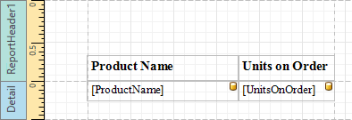
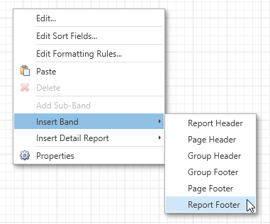
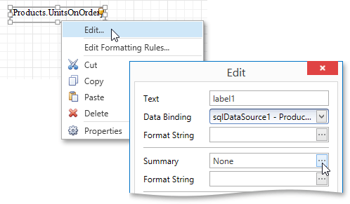
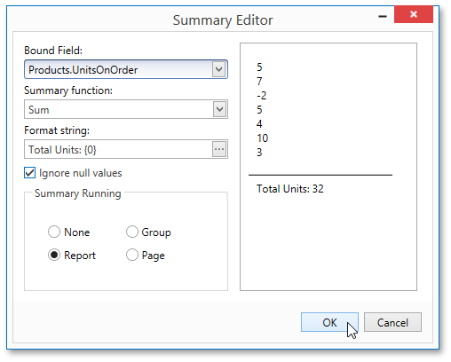
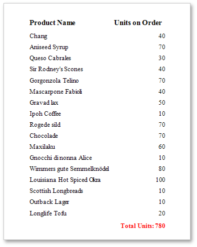

With the Report Designer, you can force a [data-bound control](../../../../../../interface-elements-for-desktop/articles/report-designer/report-designer-for-wpf/creating-reports/providing-data/binding-report-controls-to-data.md) to calculate one of the standard summary functions (**Average**, **Sum**, **Count**, **Max**, **Min**, etc.).

To calculate summaries (totals) within a report, follow the instructions below.
1. [Create a new report](../../../../../../interface-elements-for-desktop/articles/report-designer/report-designer-for-wpf/creating-reports/basic-operations/create-a-new-report.md) and [bind it to a data source](../../../../../../interface-elements-for-desktop/articles/report-designer/report-designer-for-winforms/create-reports/binding-a-report-to-data.md). This tutorial starts with the following report layout.
	
	
2. To display a summary at the bottom of the report, add the [Report Footer](../../../../../../interface-elements-for-desktop/articles/report-designer/report-designer-for-wpf/report-elements/report-bands.md) band. To do this, right-click the report's area and in the invoked context menu, select **Insert Band**, and then **Report Footer**.
	
	
3. Switch to the [Field List](../../../../../../interface-elements-for-desktop/articles/report-designer/report-designer-for-wpf/interface-elements/field-list.md) panel, select the field for which a summary will be calculated and drop it onto the created Report Footer band.
	
	
4. Right-click the newly created Label and select **Edit...** in the context menu. In the invoked dialog, click the ellipsis button for the **Summary** property.
	
	
5. In the invoked **Summary Editor**, specify the summary options. In the **Summary function** drop-down, select **Sum**. Note that in addition to a simple summary, you can choose among numerous built-in functions (such as **Count** and **Average**).
	
	The **Summary Running** option is set to **Report** to ensure that all values from the specified data field are taken into account. You can also define a summary function's **Format string**. Note that value formatting is applied to a summary independent of [general formatting](../../../../../../interface-elements-for-desktop/articles/report-designer/report-designer-for-wpf/creating-reports/shaping-data/formatting-data.md) and has a greater priority.
	
	The **Ignore NULL values** option would not affect the result in this example, since NULL values are treated like zeros by default. This option makes sense for functions like **Count** or **Average**, because the number of elements counted will depend on this option.
	
	
	
	To save the settings and close the dialog, click **OK**.

Switch your report to the [Print Preview](../../../../../../interface-elements-for-desktop/articles/report-designer/report-designer-for-wpf/document-preview.md) tab to view the result.

