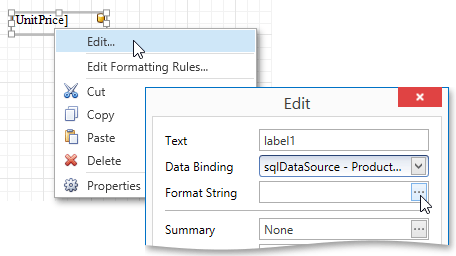
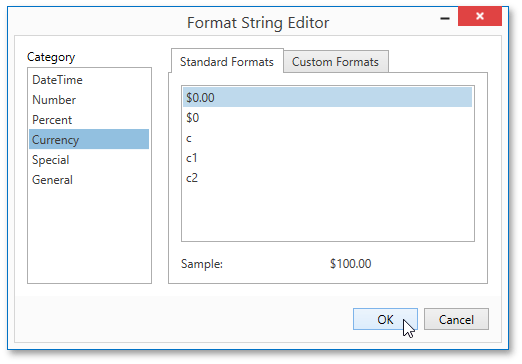
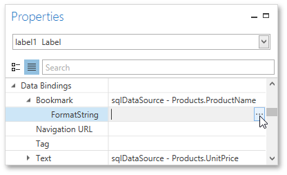

# Formatting Data
This topic describes how to change value formatting of [report elements](../../report-elements/report-controls.md) in the Report Designer. For instance, you can format a numeric value as a currency, display a date/time value in one of the standard forms depending on the culture, etc.

To apply value formatting for a [data-bound control](../providing-data/binding-report-controls-to-data.md)'s content, do the following.
1. Right-click the control, and select **Edit...** in the context menu. In the invoked dialog, click the ellipsis button for the **Format String** property.
	
	
2. In the invoked **Format String Editor**, select one of the predefined standard formats or specify a custom one.
	
	
	
	To quit the dialog and apply the changes, click **OK**.

In a similar way, you can apply formatting to a control's **Bookmark**, **Navigation URL** and **Tag** properties using the [Properties Panel](../../interface-elements/properties-panel.md). Note that the set of bindable properties depends on the control type.

When a summary function is applied to a control's dynamic content, value formatting is specified separately as described in the [Calculating Summaries](calculating-summaries.md) document.

Independently from general and summary value formatting, you can specify a native XSLX format string, which is preserved when the report is exported to XLSX. You can do this using a control's **Xlsx Format String** property.