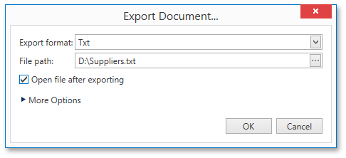
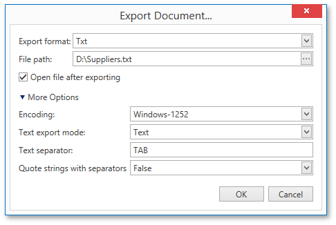

The Print Preview allows you to view and edit various format-specific options, and then export a report to one of the supported third-party formats. There are two options for [exporting](../../../../../interface-elements-for-desktop/articles/print-preview/print-preview-for-wpf/exporting/exporting.md) a document. The first way is to export a document to a file on disk using the **Export Document** dialog.

Another approach is to utilize the **Send via E-Mail** dialog to export a document and send the resulting file via e-mail.

To invoke these dialogs, click the arrow for the **Export...**  or **Send...**  button, respectively, and choose the required format from the drop-down list. If you simply click one of these buttons, the dialogs will provide settings for the PDF format. Then, you can always change the export format directly in the dialogs using the dedicated **Export Format** drop-down lists.

The following third-party export formats are supported.
* PDF (Portable Document Format)
* HTML (HyperText Markup Language)
* MHT (Web archive, single file)
* RTF (Rich Text Format)
* XLS (Microsoft&#174; Word&#174; 97 - 2003 document)
* XLSX (Office&#174; Open XML document)
* CSV (Comma-Separated Values file format)
* TXT (Plain text)
* Image (BMP, GIF, JPEG, PNG, TIFF, EMF or WMF format)

In the dialogs, you need to specify the path where the resulting file should be saved. The **Export Document** dialog additionally prompts you to choose whether or not to open the file after exporting.

The dialogs also allow you to specify advanced export options for the selected format. To access and customize these format-specific options, click the **More Options** link.

Specify the required options and click **OK** to initiate the export of a report and save the resulting file. After closing the **Send via E-Mail** dialog, the saved file will be attached to a new empty message in the default mail program.