The **Query Builder** provides a visual interface for constructing SQL queries and enables you to solve a variety of tasks.

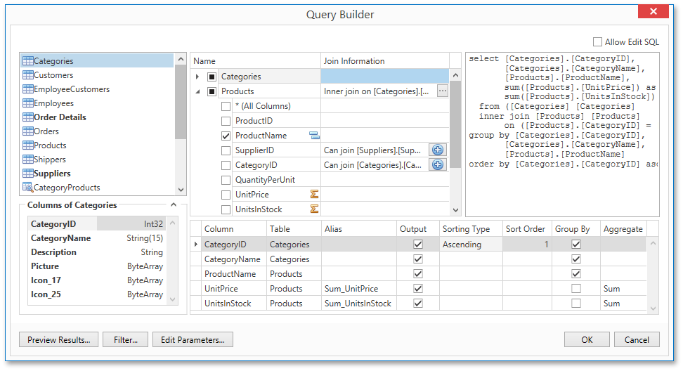

> The Query Builder is not available for [object](../../../../../interface-elements-for-desktop/articles/report-designer/report-designer-for-wpf/report-wizard/data-bound-report/connect-to-an-object-data-source.md), [Entity Framework](../../../../../interface-elements-for-desktop/articles/report-designer/report-designer-for-wpf/report-wizard/data-bound-report/connect-to-an-entity-framework-data-source.md) and [Excel](../../../../../interface-elements-for-desktop/articles/report-designer/report-designer-for-wpf/report-wizard/data-bound-report/connect-to-an-excel-data-source.md) data sources.

The document consists of the following sections.
* [Run the Query Builder](#runquerybuilder)
* [Select Tables](#selecttables)
* [Join Tables](#jointables)
* [Edit Parameters](#editparameters)
* [Filter Data](#filterdata)
* [Shape Data](#shapedata)
* [Enable Custom SQL Editing](#customsql)
* [Preview Results](#previewresults)

## <a name="runquerybuilder"/>Run the Query Builder
You can invoke the **Query Builder** from the [query customization](../../../../../interface-elements-for-desktop/articles/report-designer/report-designer-for-wpf/report-wizard/data-bound-report/connect-to-a-database/customize-the-query.md) page of the [Report Wizard](../../../../../interface-elements-for-desktop/articles/report-designer/report-designer-for-wpf/report-wizard.md) when creating a new data-bound report or when [binding an existing one to a database](../../../../../interface-elements-for-desktop/articles/report-designer/report-designer-for-wpf/creating-reports/providing-data/binding-a-report-to-data/bind-a-report-to-a-database.md). To do this, select the **Query** item and click the **Run Query Builder** button.

You can also use the Query Builder to add queries to an existing SQL data source, as well as to edit existing queries. To do this, right-click the data source in the [Report Explorer](../../../../../interface-elements-for-desktop/articles/report-designer/report-designer-for-wpf/interface-elements/report-explorer.md) and select **Manage Queries** in the context menu.

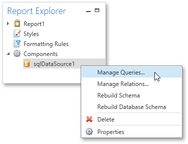

In the invoked **Manage Queries** dialog, click **Add** to add a new query. To edit an existing query, click the ellipsis button.

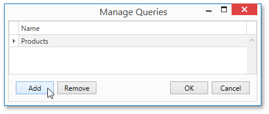

Finally, click the **Run Query Builder** button in the invoked **Data Source Wizard**.

## <a name="selecttables"/>Select Tables
To add a specific data table or view to a query, drag the corresponding item from the list of available tables and drop it onto the list of data tables to be used.

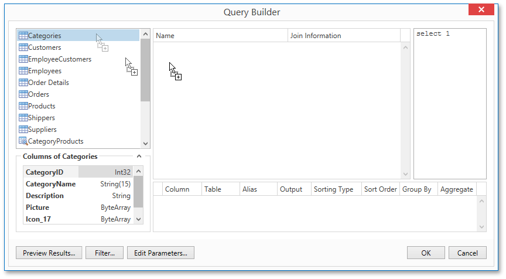

Enable check boxes for the table fields that you want to include in the query result set.

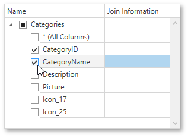

Each table provides the context menu, which allows you to rename the table or remove it from the query.

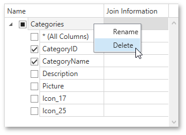

To search for a specific table or view, click the list of available tables on the left and start typing the search name.

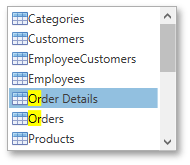

## <a name="jointables"/>Join Tables
You can join multiple tables within the same query. The Query Builder automatically highlights tables related to any of the previously added tables. Drag-and-drop a subordinate table in the same way as a principal table to include it in a query and automatically create an inner join relation based on a key column.

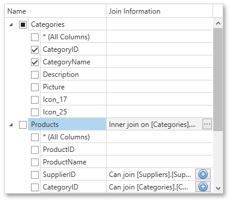

Another way to join tables is to click the  button in a row corresponding to a key column.

To customize the relationship, click the corresponding ellipsis button. Use the **Join Editor** to select the join type (**Left Outer** or **Inner**), applied logical operator (**Equals to**, **Is less than**, etc.) and column key fields.

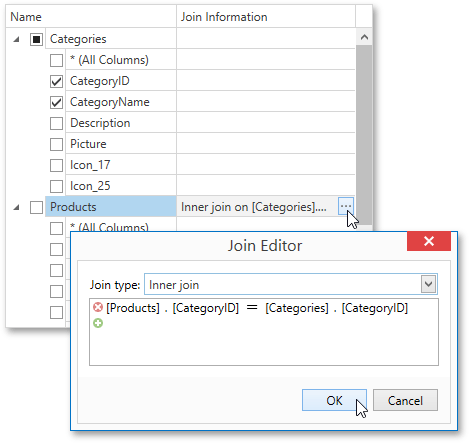

A left outer join returns all the values from an inner join along with all values in the "left" table that do not match to the "right" table, including rows with NULL (empty) values in the key field.

If tables do not have a relationship at the database level, you can manually join tables. In this case, when you drag-and-drop the required table onto the list of tables to be used, the **Join Editor** is automatically invoked allowing you to construct a custom **join** relationship.

After executing the query, it will return a "flat" table composed of data records selected based on the specified join options.

> Although joining different tables within a single query may be required in some scenarios, creating hierarchical data sources generally results in better performance (in general, [master-detail reports](../../../../../interface-elements-for-desktop/articles/report-designer/report-designer-for-wpf/report-types/master-detail-report-(detail-report-bands).md) are generated faster than similar-looking reports created by grouping "flat" data sources).

## <a name="editparameters"/>Edit Parameters
Click the **Edit Parameters** button to invoke the **Query Parameters** dialog, which allows you to add and remove [query parameters](../../../../../interface-elements-for-desktop/articles/report-designer/report-designer-for-wpf/creating-reports/providing-data/query-parameters.md) as well as specify parameter settings.

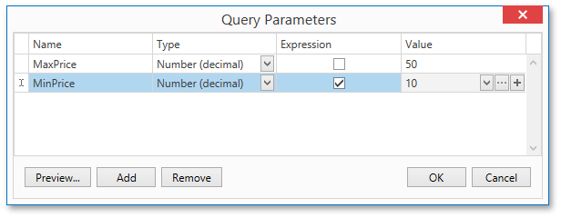

For each query parameter, the following properties are available.
* **Name** - specifies the name used to refer a parameter.
* **Type** - specifies the data type of the parameter's value.
* **Expression** - determines whether the actual parameter value is static or generated dynamically.
* **Value** - specifies the actual value of a query parameter. If the **Expression** option is enabled, the actual parameter value is produced dynamically by calculating an associated expression, which is particularly useful when you need to map the query parameter value to the value of a [report parameter](../../../../../interface-elements-for-desktop/articles/report-designer/report-designer-for-wpf/creating-reports/providing-data/report-parameters.md).

The created parameters will be then available on the [Configure Query Parameters](../../../../../interface-elements-for-desktop/articles/report-designer/report-designer-for-wpf/report-wizard/data-bound-report/connect-to-a-database/configure-query-parameters.md) wizard page.

For general information on query parameters, see [Query Parameters](../../../../../interface-elements-for-desktop/articles/report-designer/report-designer-for-wpf/creating-reports/providing-data/query-parameters.md).

## <a name="filterdata"/>Filter Data
To specify filter criteria, click the **Filter...** button in the Query Builder. This invokes the **Filter Editor**, which provides the following capabilities.

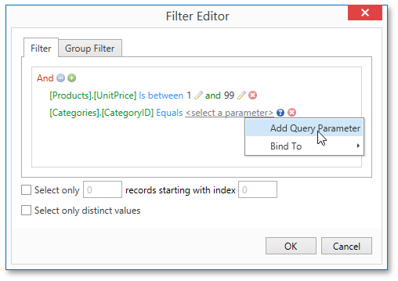
* **Filter Tab**
	
	The editor contains the **Filter** tab allowing you to specify filter conditions for resulting data. Filter criteria can be assigned [query parameters](../../../../../interface-elements-for-desktop/articles/report-designer/report-designer-for-wpf/creating-reports/providing-data/query-parameters.md) or bound to [report parameters](../../../../../interface-elements-for-desktop/articles/report-designer/report-designer-for-wpf/creating-reports/providing-data/report-parameters.md).
* **Group Filter Tab**
	
	The **Group Filter** tab allows you to specify filter conditions for grouped and aggregated data. If data is not grouped, the second tab is disabled.
* **Other Options**
	
	Using this editor, you can limit the number of resulting data rows. If data is sorted, you can specify how many rows to skip before retrieving the specified number of rows.
	
	> Depending on the selected data provider, it can be impossible to take into account the skip setting in the provider-specific SQL string.
	
	Another option enables you to include only distinct values into the resulting set.

## <a name="shapedata"/>Shape Data
The Query Builder displays the column list under the data source editor, which provides various shaping options.

The following options are available.
* **Column**
	
	Specifies the selected column.
	
	You can choose a required column in the drop-down list or create a column expression by clicking the ellipsis button for the corresponding column.
	
	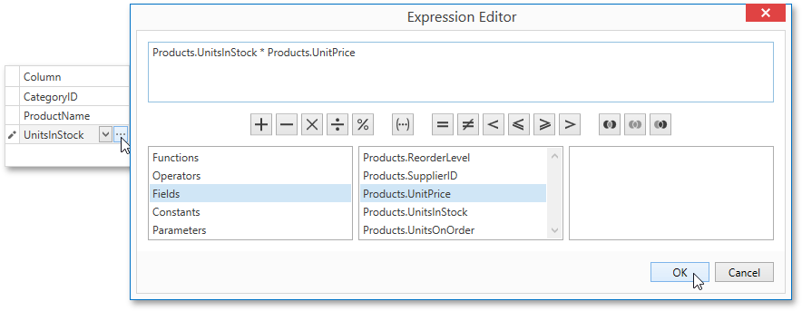
* **Table**
	
	Specifies the table containing the selected column.
	
	This option indicates **(All Tables)** if an expression is specified for the corresponding column.
* **Alias**
	
	Specifies a custom column name (alias).
	
	This option is available only for columns that are included in a query.
* **Output**
	
	Specifies whether or not the column is included into the query’s resulting set.
* **Sorting Type**
	
	Specifies whether to preserve the original order of data records within the column, or sort them (in ascending or descending order).
	
	> When binding to XML files, the Query Builder does not support sorting by aggregate functions, DISTINCT and SELECT ALL statements, and custom SQL.
* **Sort Order**
	
	This option becomes available after applying sorting to the data column records.
	
	It defines the priority in which sorting is applied to multiple columns (the less this number is, the higher the priority).
	
	For example, if column **A** has the sort order set to **1** and column **B** has it set to **2**, the query will be first sorted by column **A** and then by the column **B**.
	
	Changing this setting for one column automatically updates the sort order of other columns to avoid a conflict of priorities.
* **Group By**
	
	Specifies whether or not the query’s result set should be grouped by this column.
* **Aggregate**
	
	Specifies whether or not the column's data records should be aggregated.
	
	The following aggregate functions are supported.
	* Count
	* Max
	* Min
	* Avg
	* Sum
	* Count Distinct
	* Avg Distinct
	* Sum Distinct
	
	Applying any of these functions to a column will discard individual data records from the query result set, which will only include the aggregate function result.

> You should apply aggregation/grouping to either all columns or to none of them.
 

## <a name="customsql"/>Enable Custom SQL Editing
If custom SQL editing is enabled by your software provider, the Query Builder contains the **Allow Edit SQL** check box. Selecting this option disables the visual features of the Query Builder and allows users to specify the custom SQL string manually.

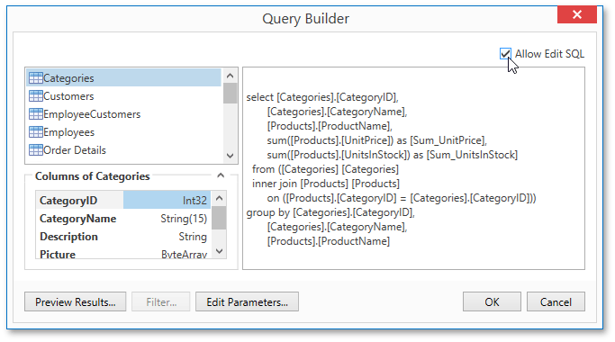

## <a name="previewresults"/>Preview Results
You can preview the result of the query execution in the form of a tabular data sample by clicking the **Preview Results** button.

This opens the **Data Preview** window displaying the query result set limited by the first 1000 data records.

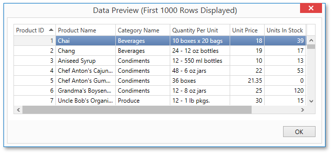