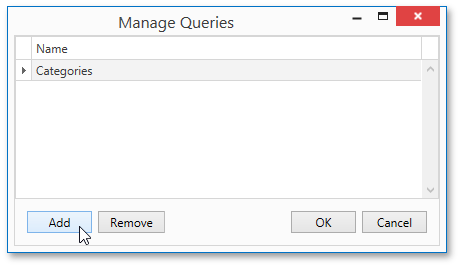
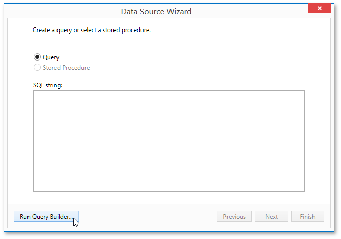
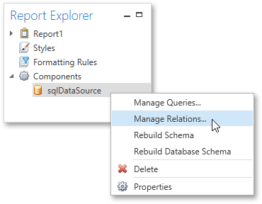
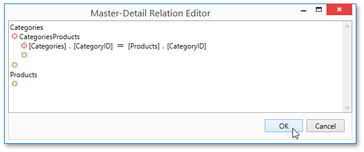
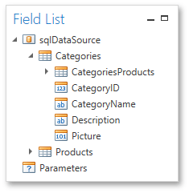
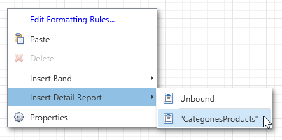
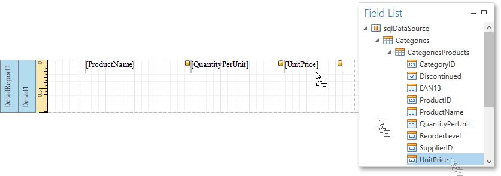
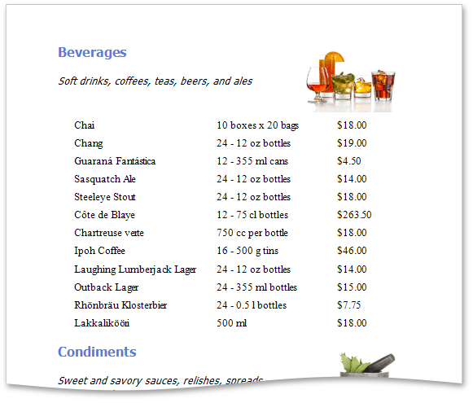

# Master-Detail Report (Detail Report Bands)
This tutorial describes the steps needed to create a _master-detail report_ with hierarchically linked data using the [Detail Report band](../../../../../interface-elements-for-desktop/articles/report-designer/report-designer-for-wpf/report-elements/report-bands.md). For an alternative approach, refer to [Master-Detail Report (Subreports)](../../../../../interface-elements-for-desktop/articles/report-designer/report-designer-for-wpf/report-types/master-detail-report-(subreports).md).

To start with this tutorial, [create a new report](../../../../../interface-elements-for-desktop/articles/report-designer/report-designer-for-wpf/creating-reports/basic-operations/create-a-new-report.md) and [bind it to a data source](../../../../../interface-elements-for-desktop/articles/report-designer/report-designer-for-wpf/creating-reports/providing-data/binding-a-report-to-data.md). For this tutorial, in the [Report Wizard](../../../../../interface-elements-for-desktop/articles/report-designer/report-designer-for-wpf/report-wizard.md), select the table that will be used as the principal table in the master-detail relation.

The topic consists of the following sections.
* [Provide a Report Data Source with a Master-Detail Relation](#masterdetail)
* [Design a Master-Detail Report](#designareport)
* [View the Result](#result)

<a name="masterdetail"/>

## Provide a Report Data Source with a Master-Detail Relation
This section of the tutorial describes how to provide an SQL data source with a master-detail relation. If you are using an Entity Framework data source that contains data members with master-detail relations between them, the existing relations will be used automatically. In this case, you can skip this section of the tutorial and proceed to the next section: [Design a Master-Detail Report](#designareport).

To add a master-detail relation to an SQL data source, do the following.
1. Add a detail table to the report data source. To do this, right-click the data source in the [Report Explorer](../../../../../interface-elements-for-desktop/articles/report-designer/report-designer-for-wpf/interface-elements/report-explorer.md), and select **Manage Queries...** in the invoked context menu.
	
	
2. In the invoked **Manage Queries** dialog, click **Add**.
	
	
3. Then, in the invoked  **Data Source Wizard**, click **Run Query Builder...**.
	
	
4. Add the detail table to the query and click **OK**.
	
	
5. Click **Finish** to exit the **Data Source Wizard**. Then, click **OK** to exit the **Manage Queries** dialog.
6. Next, specify the relation between the data source tables. To do this, right-click the data source in the **Report Explorer**, and select **Manage Relations...** in the invoked context menu.
	
	
7. In the invoked **Master-Detail  Relation Editor**, click the plus button next to the master query to add a new relation. Specify a relation condition as shown in the following image and click **OK** to exit the dialog.
	 
	
	
8. The **Field List** will be updated to reflect the added relation.
	
	

<a name="designareport"/>

## Design a Master-Detail Report
To create the layout of a master-detail report, do the following.
1. Allocate parts of a master report on the report's Detail band.
	
	
	­
	
	For the master report to be generated properly, the report's **Data Member** should be set to the master query. If you added the master query first, this property is set to the required value automatically. Otherwise, you should manually specify the data member (for instance, in the [Properties Panel](../../../../../interface-elements-for-desktop/articles/report-designer/report-designer-for-wpf/interface-elements/properties-panel.md)).
2. To add a detail report band, right-click anywhere on the report's surface, and in the invoked context menu, select **Insert Detail Report**. When the report's data source contains a data relationship, it is displayed in the context menu.
	
	
3. Then, drop the required data fields from the Field List onto the Detail Report band.
	
	Note that you should drop items from the _relation node_ (in this example it is the **CategoriesProducts** section) for the detail report to be generated correctly.
	
	

<a name="result"/>

## View the Result
The master-detail report is now ready. Switch to the [Print Preview](../../../../../interface-elements-for-desktop/articles/report-designer/report-designer-for-wpf/document-preview.md) tab and view the result.

