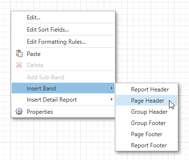
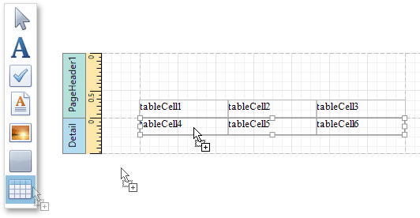
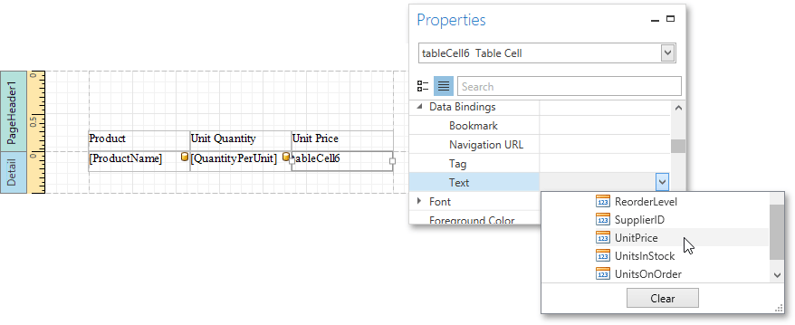

This tutorial describes how to create a _table report_, which means that the report's data is arranged into a table-like layout. This feature should not be confused with the [master-detail report](../../../../../interface-elements-for-desktop/articles/report-designer/report-designer-for-wpf/report-types/master-detail-report.md) or [cross-tab report](../../../../../interface-elements-for-desktop/articles/report-designer/report-designer-for-wpf/report-types/cross-tab-report.md).

To create a table report, follow the steps below.
1. [Create a new report](../../../../../interface-elements-for-desktop/articles/report-designer/report-designer-for-wpf/creating-reports/basic-operations/create-a-new-report.md) and [bind it to a data source](../../../../../interface-elements-for-desktop/articles/report-designer/report-designer-for-wpf/creating-reports/providing-data/binding-a-report-to-data.md).
2. To add a [Page Header](../../../../../interface-elements-for-desktop/articles/report-designer/report-designer-for-wpf/report-elements/report-bands.md) to the report, right-click on the report's surface, and in the invoked context menu, select **Insert Band** and then **Page Header**.
	
	
3. Next, add two [Table](../../../../../interface-elements-for-desktop/articles/report-designer/report-designer-for-wpf/report-elements/report-controls.md) controls to the report's Page Header and Detail band.
	
	To do this, drag the Table control from the [Toolbox](../../../../../interface-elements-for-desktop/articles/report-designer/report-designer-for-wpf/interface-elements/control-toolbox.md) and drop it onto the Page Header Band. Then, add a table to the Detail band in the same way.
	
	
	
	One table will be used as a header, and the other one - for the report's detail information.
4. Type the headers into the upper table's cells. Then, bind the corresponding cells in the detail section to the appropriate data fields by expanding the **Data Bindings** option and setting the **Text** property.
	
	
5. Finally, you can customize various properties of the tables to improve their appearance. For example, in the [Properties Panel](../../../../../interface-elements-for-desktop/articles/report-designer/report-designer-for-wpf/interface-elements/properties-panel.md), you can define the **Borders** property, as well as the **Background Color** property. To customize cell text options, specify the **Font** property.
	
	A noteworthy feature is the capability to specify [odd and even styles](../../../../../interface-elements-for-desktop/articles/report-designer/report-designer-for-wpf/creating-reports/appearance-customization/use-odd-and-even-styles.md) for the detail table.

The table report is now ready. Switch to the [Print Preview](../../../../../interface-elements-for-desktop/articles/report-designer/report-designer-for-wpf/document-preview.md) tab, and view the result.

