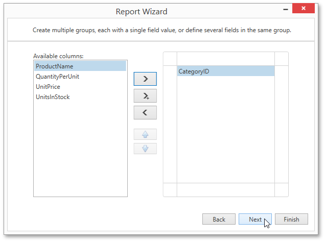
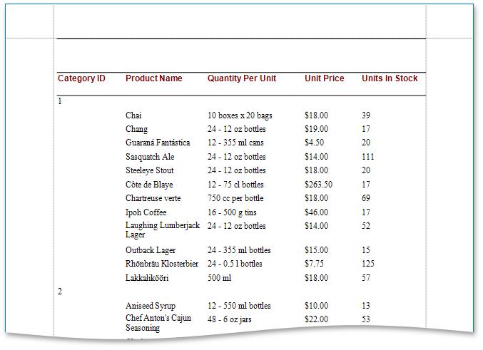

This wizard page allows you to group data in a report. If you don't need to group your data, click **Next** to skip this step.

Nested grouping and grouping against multiple fields are fully supported. The following image illustrates all basic grouping types.

The list on the left-hand side displays data fields that can be used to group data. To apply grouping, select the required field and click the right arrow button. To group data against multiple columns, use the  button.

To remove a grouping field, select it in the list on the right-hand side and click the left arrow button. You can also change the order of grouping fields using the up and down arrow buttons.

You can stop the wizard on this step by clicking **Finish**. In this case, the report will look similar to the one in the image below.

If you want to customize your report further, click **Next**. If data grouping has been applied on this page, proceed to the [Specify Summary Options](../../../../../../interface-elements-for-desktop/articles/report-designer/report-designer-for-wpf/report-wizard/data-bound-report/specify-summary-options.md) page. If you haven't grouped your data, skip the Summaries step and go to the [Choose a Report Layout](../../../../../../interface-elements-for-desktop/articles/report-designer/report-designer-for-wpf/report-wizard/data-bound-report/choose-a-report-layout.md) page.