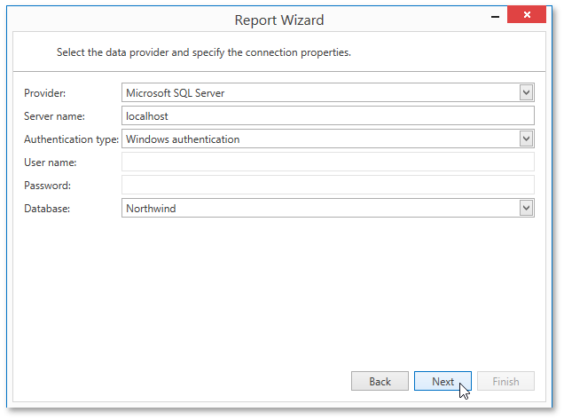

# Specify a Connection String
On this page, define a custom connection string or select one of the supported data providers.

Select the provider type in the **Provider** drop-down list. Next, specify the connection options required for the selected provider type (e.g., authentication type and database name).

The following data source types are supported.
* Microsoft SQL Server
* Microsoft Access 97
* Microsoft Access 2007
* Microsoft SQL Server CE
* Oracle
* Amazon Redshift
* Google BigQuery
* Teradata
* Firebird
* IBM DB2
* MySQL
* Pervasive PSQL
* PostgreSQL
* SAP Sybase Advantage
* SAP Sybase ASE
* SQLite
* VistaDB
* VistaDB5
* XML file

Click **Next** to proceed to one of the next wizard pages, depending on whether or not the created connection uses server authentication.
* [Save the Connection String](save-the-connection-string.md) - if server authentication is required, this page allows you to specify whether or not to save user credentials along with the connection string.
* [Customize the Query](customize-the-query.md) - if server authentication is not required, proceed to constructing the query.