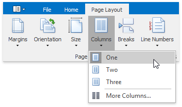
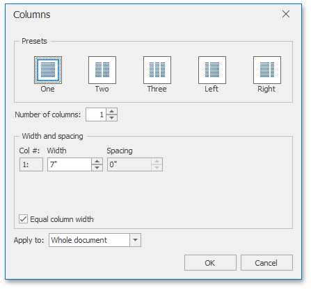
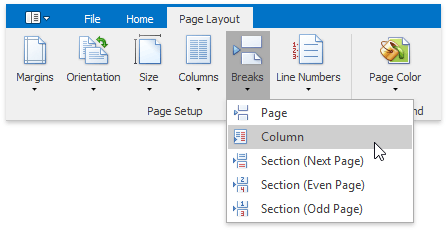
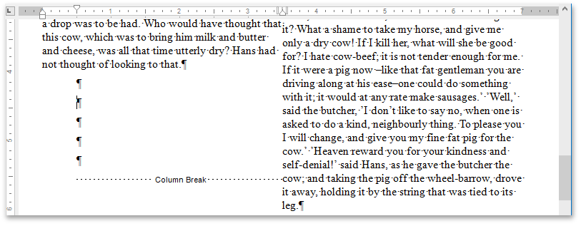

# Lay Out Text in Columns
To split a text into columns, follow the steps below.
1. Click within a [section](../../../../interface-elements-for-desktop/articles/rich-text-editor/document-layout-and-page-setup/divide-a-documents-into-sections.md) which you wish to lay out in several columns.
2. On the **Page Layout** [ tab](../../../../interface-elements-for-desktop/articles/rich-text-editor/text-editor-ui/ribbon-interface.md), in the **Page Setup** group, click the **Columns** button and select the number of columns into which the text should be split...
	
	
	
	... or click **More Columns** to invoke the **Columns** dialog where you can adjust columns layout of the text in a more flexible way for the current section or the whole document.
	
	

To move the text to the next column (if the text in the current section is laid out into multiple columns), insert a column break.
1. Click within a document where you wish to insert a column break.
2. On the **Page Layout** [ tab](../../../../interface-elements-for-desktop/articles/rich-text-editor/text-editor-ui/ribbon-interface.md), in the **Page Setup** group, click the **Breaks** button and select **Column** from the invoked list...
	
	
	
	... or press **CTRL+SHIFT+ENTER**.

To show the column break mark, press **CTRL+SHIFT+8** or click the **Show/Hide Paragraph** button on the **File** tab.

In a document, column breaks are marked as illustrated below.

