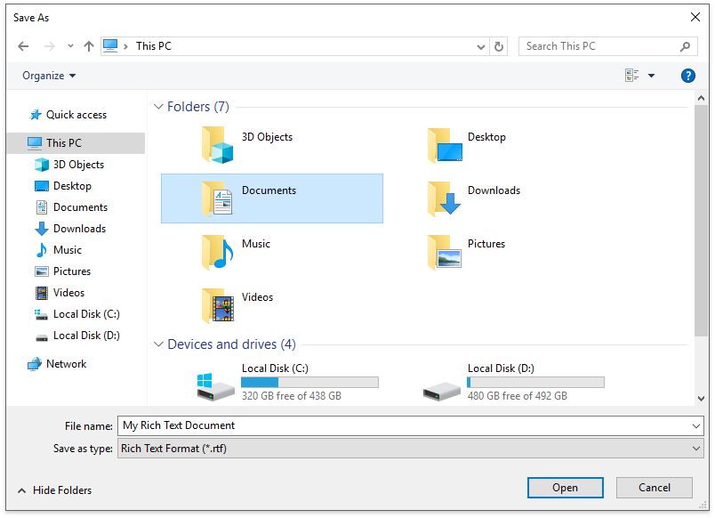

# Save a Document
To save a document, on the **File** [ tab](../text-editor-ui/ribbon-interface.md), in the **Common** group, click the **Save** button or use the **CTRL+S** keyboard shortcut. This allows you to save a document using the save parameters that were previously set.

If you want to save a document using another file name or to modify other parameters (e.g. file format or location), on the **File** [ tab](../text-editor-ui/ribbon-interface.md), in the **Common** group, click the **Save As** button or press the **F12** key.

After that, the **Save As** dialog will appear. Note that the same dialog appears if you click the **Save** button to save a document, which has been never saved before.

In this dialog you can specify document name, document format and the location to which the document should be saved. The **Rich Text Editor** allows you to save documents in the following formats:
* Rich Text Format (*.rtf)
* Text Files format (*.txt)
* Hyper Text Markup Language format (*.htm, *.html)
* web page archive format (*.mht)
* Microsoft Word 97-2003 format (*.doc)
* WordML (*.xml)
* Open Office XML format (aka Office 2007 or *.docx)
* Open Document Format (*.odt)
* Electronic Publication (*.epub)

> When saving a document in HTML format, in-line pictures are saved in the %FileName%_files folder, where %FileName% is the name of the document file. Image files are named "imageN.png", where N is the picture index starting from the beginning of the document.