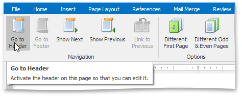
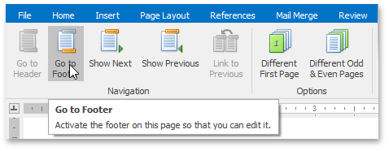
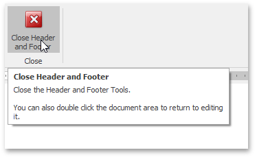
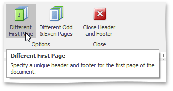
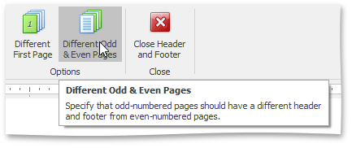

Headers and footers are the areas at the bottom or the top of each page in a document. You can insert text or graphics into headers and footers (for example, [page numbers](../../../interface-elements-for-desktop/articles/rich-text-editor/miscellaneous/insert-page-numbers.md), a [company logo](../../../interface-elements-for-desktop/articles/rich-text-editor/pictures-and-text-boxes/insert-a-picture.md), the document title or file name, the author's name).

## Insert a Header or Footer
1. On the **Insert** [tab](../../../interface-elements-for-desktop/articles/rich-text-editor/text-editor-ui/ribbon-interface.md), in the **Header&amp;Footer** group, click the **Header** or **Footer** button.
	
	   
2. Type text or insert graphics in the header or footer area.
3. To switch between the header and footer areas, use the **Go to Header** and **Go to Footer** buttons of the **Header &amp; Footer Tools / Design** ribbon tab.
	
	 
4. If necessary, you can [align](../../../interface-elements-for-desktop/articles/rich-text-editor/formatting/format-paragraphs.md) and [format text](../../../interface-elements-for-desktop/articles/rich-text-editor/formatting/format-text.md) in the header and footer areas, as required.
5. To finish, double-click anywhere in the document, or on the **Header &amp; Footer Tools / Design** [tab](../../../interface-elements-for-desktop/articles/rich-text-editor/text-editor-ui/ribbon-interface.md), in the **Header&amp;Footer** group, click **Close Header and Footer**.
	
	

## Create a Different Header or Footer for the First Page
You can skip the header or footer on the first page, or create a unique header or footer for the first page of the document.
1. Double-click the header or footer area on the first page of the document.
2. On the **Header &amp; Footer Tools / Design** [tab](../../../interface-elements-for-desktop/articles/rich-text-editor/text-editor-ui/ribbon-interface.md), in the **Options** group, click the **Different First Page** button.
	
	
3. If necessary, click the **Show Next** and **Show Previous** buttons on the **Header &amp; Footer Tools / Design** tab to activate the **First Page Header** and **First Page Footer** areas.
	
	 
4. Change the contents of the header or footer on the first page (or delete the contents of the header or footer to use no header or footer on the first page of the document).

## Create a Different Header or Footer for Odd and Even Pages
1. On the **Insert** [tab](../../../interface-elements-for-desktop/articles/rich-text-editor/text-editor-ui/ribbon-interface.md), in the **Header&amp;Footer** group, click the **Header** or **Footer** button.
	
	   
2. On the **Header &amp; Footer Tools / Design** tab, in the **Options** group, click the **Different Odd &#38; Even Pages** button.
	
	
3. If necessary, click the **Show Next** and **Show Previous** buttons on the **Header &amp; Footer Tools / Design** tab to move into the header or footer areas of odd or even pages.
	
	 
4. Create the header or footer for odd pages in the **Odd Page Header** or **Odd Page Footer** areas and create the header or footer for even pages in the **Even Page Header** or **Even Page Footer** areas.

## Use Specific Headers and Footers for Each Section
If your [document is divided into sections](../../../interface-elements-for-desktop/articles/rich-text-editor/document-layout-and-page-setup/divide-a-documents-into-sections.md), you can specify different headers and footers for each section.
1. Click the first section from the document beginning whose headers and footers you wish to change.
2. Click the **Header** or **Footer** button on the **Insert** [tab](../../../interface-elements-for-desktop/articles/rich-text-editor/text-editor-ui/ribbon-interface.md).
	
	   
3. On the **Header &amp; Footer Tools / Design** tab, in the **Navigation**, click **Link to Previous** group to break the connection between the current section and the previous section.
	
	
4. Modify the existing header or footer as required, or create a new header or footer for the current section.
5. Repeat the previous two steps for the next sections for which you want to set specific headers and footers. Use the **Show Next** button on the **Header &amp; Footer Tools / Design** ribbon tab to navigate to header or footer areas of the next sections.
	
	