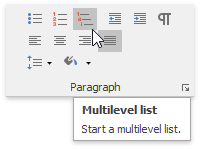
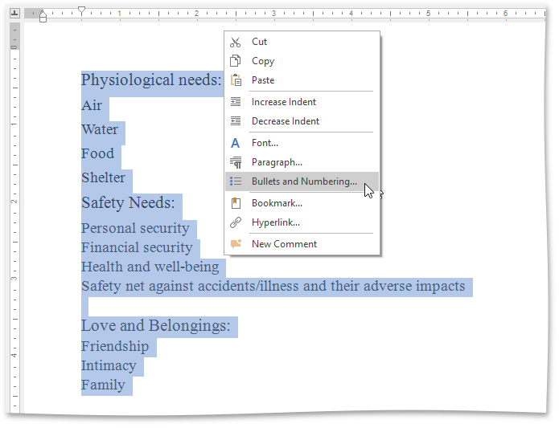
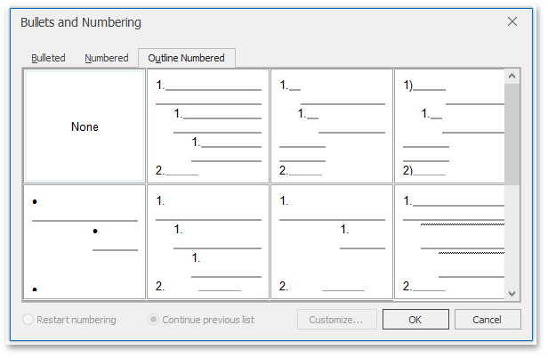
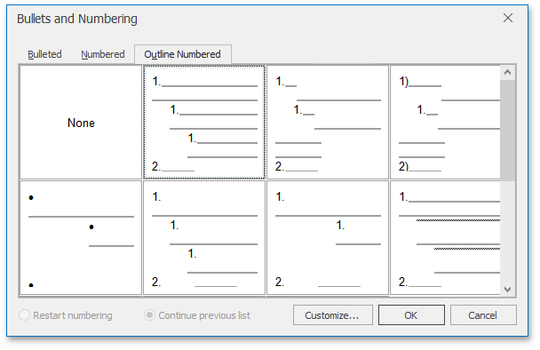
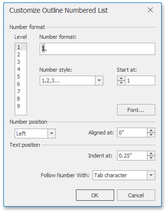
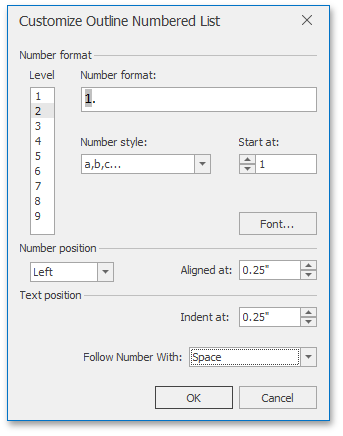
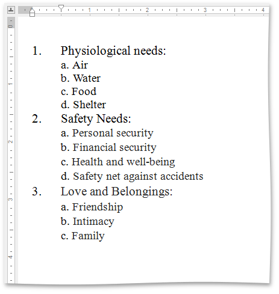

# Multilevel Lists
## Create a Multilevel List as You Type
1. Point to the position within a document from which you want to begin your list.
2. On the **Home** [ tab](../text-editor-ui/ribbon-interface.md), in the **Paragraph** group, click the **Multilevel list**  button.
	
	
3. Type the text.
4. To change levels of the list, press **TAB** and **SHIFT+TAB**, or, on the **Home** [ tab](../text-editor-ui/ribbon-interface.md), in the **Paragraph** group click the **Increase Indent**  and **Decrease Indent**  buttons. Press **ENTER** to create the next item on the current level.
5. To finish the list, press **ENTER** twice.

## Make a Multilevel List from the Selected Text
You can make multilevel list from existing lines of text in two ways. The first one is to use the **Paragraph** toolbar:
1. Select the text lines that you want to transform into a list.
2. On the **Home** [ tab](../text-editor-ui/ribbon-interface.md), in the **Paragraph** group, click the **Multilevel list**  button.
3. Use **TAB** and **SHIFT+TAB**, or the **Increase Indent**  and **Decrease Indent**  buttons to change levels.

Another way to do the same thing is to use the [context menu](../text-editor-ui/editor-elements.md):
1. Select the text to be transformed into a list.
2. Right-click within the document and select the **Bullets and Numbering** item from the invoked context menu.
	
	
3. In the invoked **Bullets and Numbering** dialog, click the **Outline Numbered** tab and choose the list style that you want to apply.
	
	
4. Use **TAB** and **SHIFT+TAB**, or the **Increase Indent**  and **Decrease Indent**  buttons of the **Paragraph** toolbar to change levels.

## Create Your Own List Style
You can create your own style for a multilevel list on the basis of one of the existing list styles, by changing different list parameters.
1. Select the multilevel list (or text to be transformed into the multilevel list) to which you want to apply your own style.
2. Right-click within the document and select the **Bullets and Numbering** item from the resulting [context menu](../text-editor-ui/editor-elements.md). The **Bullets and Numbering** dialog will be displayed.
	
	
3. Click the **Outline Numbered** tab, choose one of the existing styles and click **Customize...**. The **Customize Outline Numbered List** dialog will be invoked.
	
	
	
	> The **Customize...** button is disabled if the **None** item of the **Bullets and Numbering** dialog is selected.
4. In this dialog, change different list parameters to create your own list style.
	
	For instance, if you specify list parameters in the following way,...
	
	
	
	...you will get the list style as illustrated below.
	
	
5. Use **TAB** and **SHIFT+TAB**, or the **Increase Indent**  and **Decrease Indent**  buttons of the **Paragraph** toolbar, to change levels.