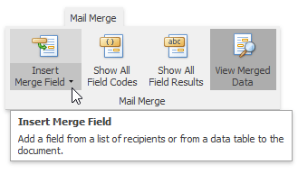
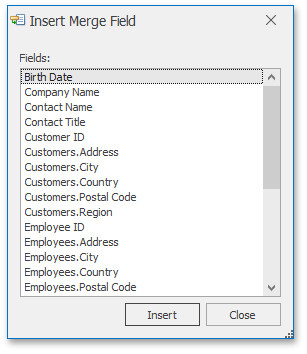
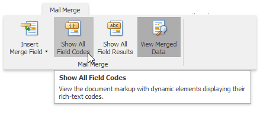

# Mail Merge
The **Mail Merge** feature enables you to use the text retrieved from a data source for filling in the fields in a document template. This feature is useful for letters, catalogs, mailing labels, and for personalizing any kind of a document.

> If the data source provides formatted text to insert in the merge field, its formatting will not be recognized and properly processed.

To merge data fields in a **Rich Text Editor** document, perform the following steps.
* **Prepare a Data Source**
	
	To perform a mail merge, you need a template and a data source. The template is a document containing fields (placeholders for the information that will be merged). The data source contains data that will be merged into the fields in the document template to create merged documents.
	
	&nbsp;
* **Create a Template for Mail Merge (Insert Fields)**
	
	When an application runs with the mail merge data source attached to the **Rich Text Editor**, you can create a template for mail merge. To do this, [create a new document](../../../interface-elements-for-desktop/articles/rich-text-editor/file-operations/create-a-new-document.md), type the mail content and insert merge fields into this document. To insert fields, on the **Mail Merge** [tab](../../../interface-elements-for-desktop/articles/rich-text-editor/text-editor-ui/ribbon-interface.md), in the **Mail Merge** group, click the **Insert Merge Field** button.
	
	
	
	The drop-down list or a dialog window containing field names will be shown.
	
	
	
	Choose the required field and click **Insert**. The field is inserted at the cursor position.
	
	&nbsp;
* **Preview Field Values**
	
	The **Show All Field Codes** button on the **Mail Merge** tab displays field codes for all fields in the document.
	
	
	
	The **Show All Field Results** button on the **Mail Merge** ribbon tab displays field placeholders if the **View Merged Data** button is switched off. If this button is switched on, then the current record of the data source is displayed in place of the field.
	
	
	
	The merge field code looks like the following:
	
	{MERGEFIELD "_field name_" [\* MERGEFORMAT]}
	
	The optional \* MERGEFORMAT switch, which you can add manually, retains formatting applied to the field.
	
	&nbsp;