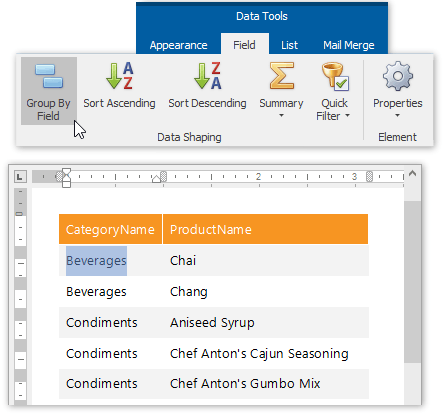
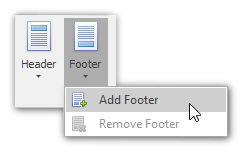
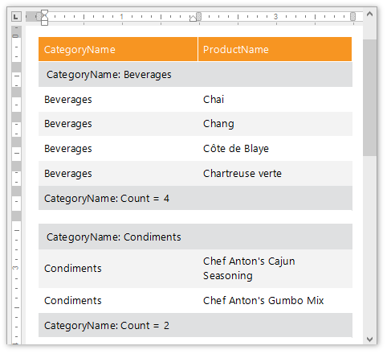
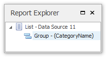

This document describes how to group data in a **Snap** document.

To group dynamic data within a **Snap list**, select the **field** that you wish to group. This automatically activates the contextual [Data Tools: Field](../../../../interface-elements-for-desktop/articles/snap-reporting-engine/graphical-user-interface/main-toolbar/data-tools-field.md) tab in the main toolbar. In this tab, click the **Group By Field** button.

The Snap list will be updated to reflect the applied grouping.

A group header and a group footer are automatically created for the new grouping. By default, the group header displays the value of the field by which to group, and the group footer displays the total count of entries in the group (evaluated by the **Count** **summary function**).

To add or remove group headers and footers, use the corresponding commands in the [Group](../../../../interface-elements-for-desktop/articles/snap-reporting-engine/graphical-user-interface/main-toolbar/data-tools-group.md) tab of the main toolbar.

The following image illustrates a Snap list with grouping applied.

All groupings added to a report are displayed in the [Report Explorer](../../../../interface-elements-for-desktop/articles/snap-reporting-engine/graphical-user-interface/snap-application-elements/report-explorer.md) as child nodes of the Snap list to which they are applied.

