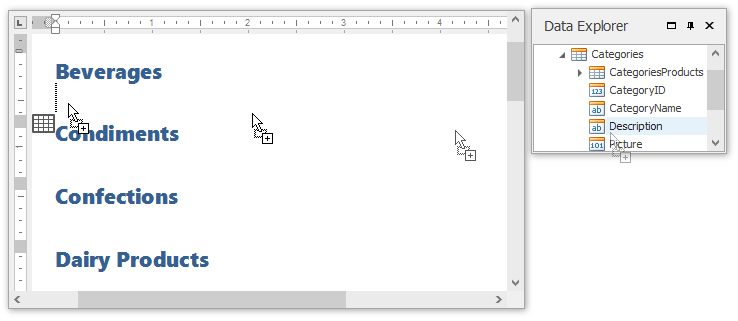
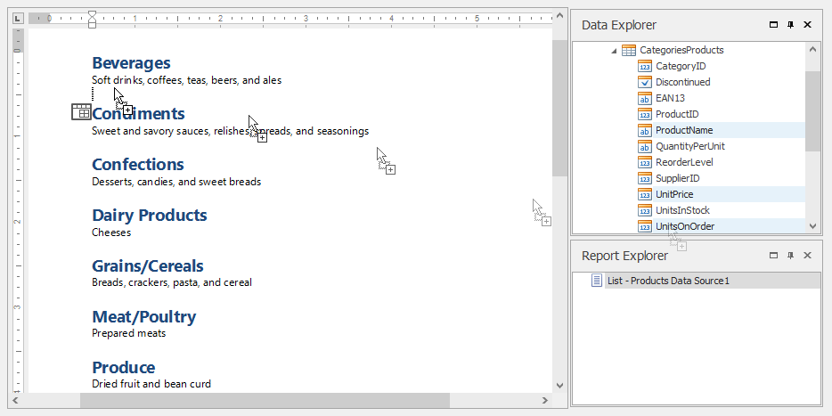
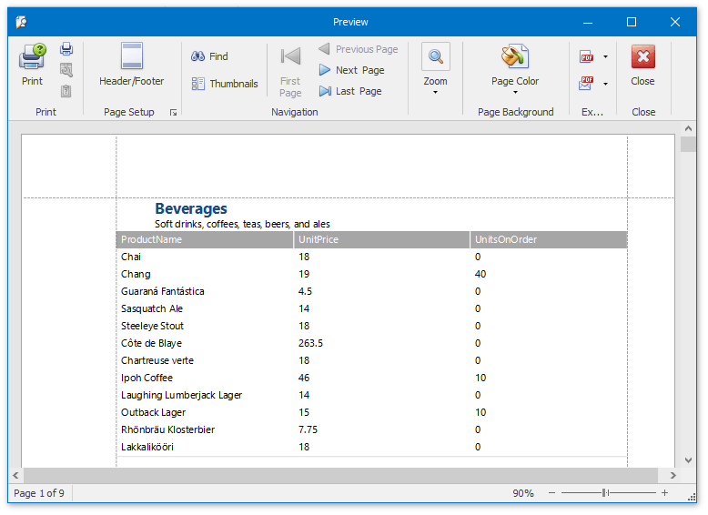

# Create a Master-Detail Report
This document will guide you through the process of creating a master-detail report. Reports of this type are built upon hierarchical data sources, so to be able to create a master-detail report, you need to provide a report data source with a master-detail relation.

To get started with this tutorial, create a new Snap document and [add a master-detail relation](../../../../interface-elements-for-desktop/articles/snap-reporting-engine/connect-to-data/create-a-master-detail-data-source.md) to it.

Perform the following steps to create a master-detail report.
1. Create a master report. To do this, drag-and-drop data fields of the master data table from the [Data Explorer](../../../../interface-elements-for-desktop/articles/snap-reporting-engine/graphical-user-interface/snap-application-elements/data-explorer.md) to the design surface. You can use any type of layout.
	
	
2. To create a detail report, drag-and-drop data fields of the detail data table from the **Data Explorer** onto the lower border of the master report's data row, as shown in the image below.
	
	
3. The master-detail report is now ready. Click the **Print Preview** button in the [General Tools: File](../../../../interface-elements-for-desktop/articles/snap-reporting-engine/graphical-user-interface/main-toolbar/general-tools-file.md) tab of the main toolbar to view the preview.
	
	