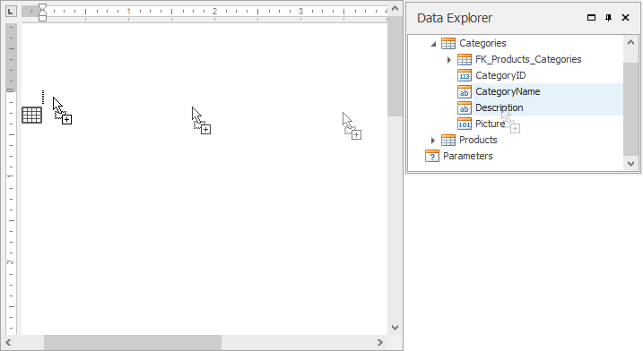
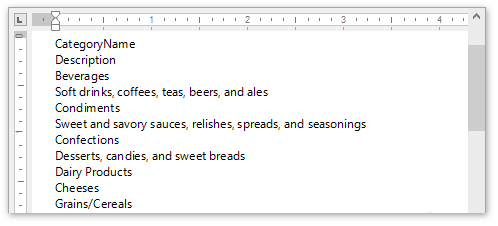
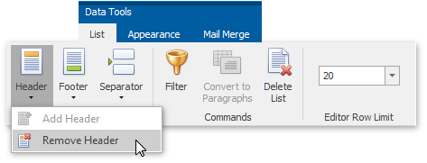
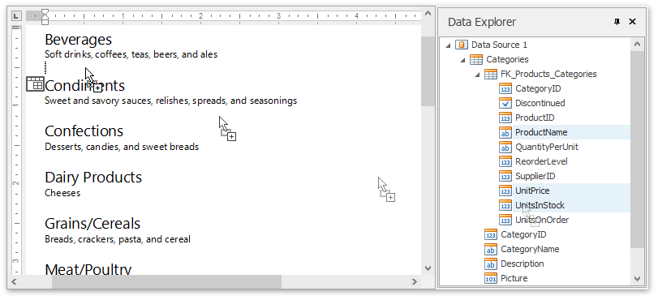
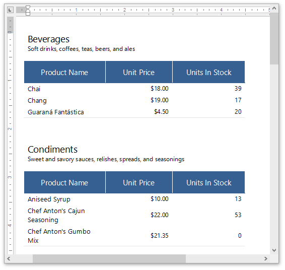
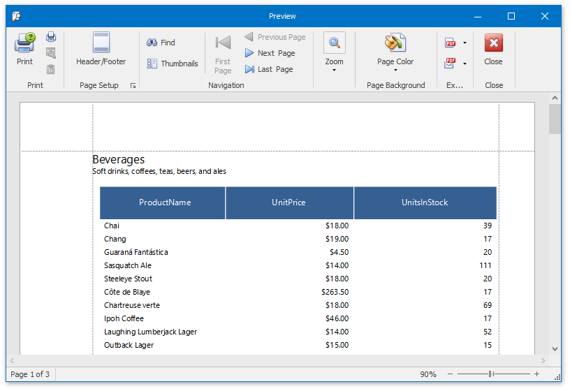

# Create a Table Report
This tutorial will guide you through the process of creating a **Table Report**, and printing and saving it to your hard drive.
 The table report is a data-aware **Snap** report with a tabular master-detail layout.

To get started with this tutorial, create a new Snap document and provide a hierarchical data source for it, as described in the [Create a Master-Detail Data Source](../../../../interface-elements-for-desktop/articles/snap-reporting-engine/connect-to-data/create-a-master-detail-data-source.md) topic.

To create a master-detail Snap document layout, do the following.
1. Create a simple tabular report by selecting the data fields that you wish to include in the report in the [Data Explorer](../../../../interface-elements-for-desktop/articles/snap-reporting-engine/graphical-user-interface/snap-application-elements/data-explorer.md) and dragging them to the [Design Surface](../../../../interface-elements-for-desktop/articles/snap-reporting-engine/graphical-user-interface/snap-application-elements/design-surface.md). When you drop data fields onto the empty space in the document body, they are added as columns of a table. You can select multiple data fields by pressing **CTRL** or **SHIFT**.
	
	
	
	To improve performance, Snap shows only the first **20** data rows of a Snap list by default. To change this setting, use the **Editor Row Limit** option, which is located on the [List](../../../../interface-elements-for-desktop/articles/snap-reporting-engine/graphical-user-interface/main-toolbar/data-tools-list.md) tab of the main toolbar.
	
	
2. To convert the layout of a Snap list to a paragraph presentation, select the Snap list you wish to convert and click the **Convert to Paragraphs** command in the **List** tab of the contextual **Data Tools** toolbar category. Note that there is no reverse action allowing you to convert a Snap list back to the tabbed form.
	
	
	
	The report should now appear as shown in the following image.
	
	
	
	To remove a list header, select the Snap list, click the **Header** command in the **List** tab of the main toolbar, and select **Remove Header** in the invoked drop-down menu.
	
	
3. To create a detail report, drag data fields from the child data table in the **Data Explorer** onto the lower border of the master report's data row, as shown in the image below.
	
	
	
	The added detail part will have a tabular form by default.
	
	
4. To preview your Snap document click the **Print Preview** button in the [General Tools: File](../../../../interface-elements-for-desktop/articles/snap-reporting-engine/graphical-user-interface/main-toolbar/general-tools-file.md) tab of the main toolbar.
	
	