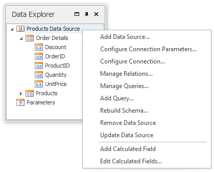

# Data Explorer
This topic describes how to use the **Data Explorer** in Snap.

This topic consists of the following sections.
* [Overview](#overview)
* [Data Type Reference](#description)

## <a name="overview"/>Overview
The Data Explorer is essential for managing data in Snap applications. It allows you to **add new data sources** to a Snap document, access their structure and run the [Query Builder](../../../../../interface-elements-for-desktop/articles/snap-reporting-engine/connect-to-data/use-the-query-builder.md) to customize a data source.

Using the Data Explorer, you can also manage a report's parameters, as well as the [calculated fields](../../../../../interface-elements-for-desktop/articles/snap-reporting-engine/connect-to-data/use-calculated-fields.md) supplied to the data source tables.

You can create a Snap report layout by dropping the data members from the Data Explorer onto a document's [design surface](../../../../../interface-elements-for-desktop/articles/snap-reporting-engine/graphical-user-interface/snap-application-elements/design-surface.md). The data members correspond to the columns created on the design surface, and the data member names are displayed in the column headers.

To display data in a chart, drop data fields from the Data Explorer onto the corresponding chart areas.

When a data field is added to your document, its data type determines what **element** is created (e.g., text, **chart**, or **bar code**).

## <a name="description"/>Data Type Reference
In the Data Explorer, different icons are assigned to various data objects. These icons are explained in the following table.

| Regular Data Source | Mail Merge Data Source | Description |
|---|---|---|
|  |  | Designates an individual data source. When expanded, shows the hierarchy of its tables and/or views. |
|  |  | Designates a data table or view within a data source. When expanded, shows the hierarchy of its data fields. You can drag a data table and drop it onto the document surface, after which the entire table structure will be presented in the report in a tabular form. |
|  |  | Parameters. Lists the report parameters. You can include parameters in a document's filtering expression or calculated fields, or you can use them directly in your reports, (e.g., by dropping them onto the document surface). |

For every table or view, the Data Explorer lists the available data fields. Depending on the data type, it will automatically assign one of the following icons.

| Regular Data Source | Mail Merge Data Source | Data Type | Displayed Contents |
|---|---|---|---|
|  |  | Boolean | Check Box, plain text |
|  |  | Byte | Bar Code, Picture |
|  |  | Date-time | Plain text |
|  |  | Numeric | Plain text, Bar Code |
|  |  | String | Plain text, Bar Code |
|  |  | **Calculated field** | Determined by the result of the calculation. |