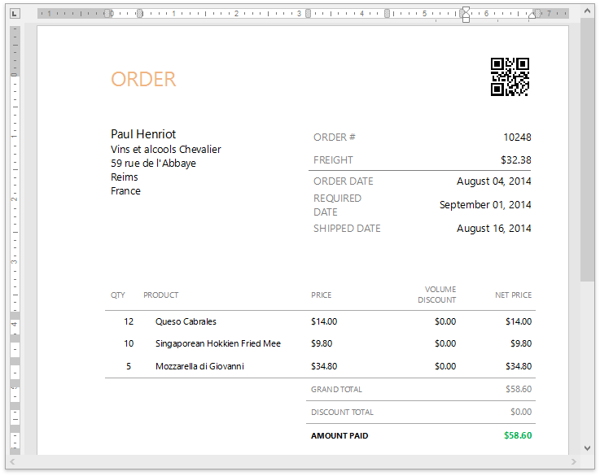
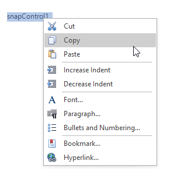

# Design Surface
This document describes the design surface of a Snap application.

The design surface is the primary working area of a Snap application, which contains the document and allows you to modify its layout.

It can display rulers that define the horizontal and vertical alignment of a report's elements, as well as a scroll bar that allows you to browse different pages of a document.

Right-clicking the design surface invokes the context menu, which displays a specific set of commands based on the element that is clicked.

The WYSIWYG nature of Snap allows you to view document content on the design surface in the same way it will appear on paper. However, the complete document (as it appears in a Print Preview) may differ from the document layout shown in the design surface. For example, setting the **List** | **Editor Row Limit** toolbar option limits the total number of processed data records while the document layout is being designed.

The [View](../../../../../interface-elements-for-desktop/articles/snap-reporting-engine/graphical-user-interface/main-toolbar/general-tools-view.md) toolbar contains the commands that allow you to switch the document presentation mode (**Simple View**, **Draft View**, **Print Layout**), as well as maintain the visibility of rulers and the document zoom factor.