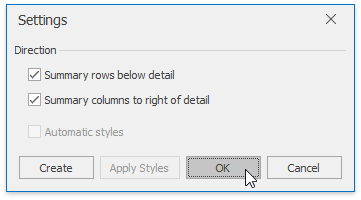
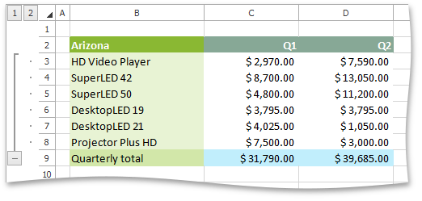
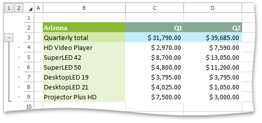

# Outline Data
The **Spreadsheet** provides you with the capability to split a large amount of data into separate groups and display summary rows and columns for each group. Data grouping is useful when you wish to temporally hide unnecessary rows or columns to display only significant information.

Select the action you wish to perform.
* [Group Rows and Columns](#groupmanually)
* [Outline Data Automatically](#groupautomatically)
* [Expand or Collapse Groups](#collapsegroup)
* [Specify Group Settings](#groupsettings)

## <a name="groupmanually"/>Group Rows and Columns
* To **group** data in a worksheet, do the following.
	1. Select the rows or columns you wish to group.
	2. On the **Data** tab, in the **Outline** group, click the **Group** button, and select the **Group** item in the button's drop-down menu...
	
	> You can also place one group of rows or columns inside another. To do this, repeat the steps above until you create the required number of groups. Note that the number of nested groups is limited: you can create a maximum of **seven levels** of grouping.
* To **ungroup** data in a worksheet, do the following.
	1. Select the rows or columns you wish to ungroup.
	2. On the **Data** tab, in the **Outline** group, click the **Ungroup** button, and select the **Ungroup** item in the button's drop-down menu...

## <a name="groupautomatically"/>Outline Data Automatically
The **Spreadsheet** allows you to create an automatic outline of rows and columns based on subtotal and summary formulas contained in a worksheet.
* To **create an automatic outline**, do the following.
	1. Specify the summary rows or columns containing formulas that reference cells to be outlined. If you do not specify any summary formulas, the data will not be grouped.
	2. On the **Data** tab, in the **Outline** group, click the **Group** button, and select the **Auto Outline** item in the button's drop-down menu.
		
		
* To **remove an automatic outline**, do the following.
	
	On the **Data** tab, in the **Outline** group, click the **Ungroup** button, and select the **Clear Outline** item in the button's drop-down menu.
	
	

## <a name="collapsegroup"/>Expand or Collapse Groups
* **Using the outline symbols**
	
	Since the group is created, it is marked by the grouping bar displayed along the grouped rows to the left side of a worksheet and along the grouped columns at the top of a worksheet. Each grouping bar is accompanied by a **plus**  or **minus**  outline symbol (depending on the group state). To collapse the required group, click the minus sign, which automatically changes into a plus sign after the group is collapsed, or just click the grouping bar itself. To expand the collapsed group, click the plus sign.
	
	You can also use the **Hide Detail** and **Show Detail** buttons in the **Outline** group to hide or display the detail rows and columns for a specific group.
	
	
* **Using the outline buttons**
	
	If your data is divided into different grouping levels , you can collapse or expand multiple groups at once using the **outline buttons** . The outline buttons for row grouping are displayed above the row headers, while the outline buttons for column grouping are shown to the left of the column headers. Each outline button has a number that indicates a grouping level. For example, if you have two levels of grouping, the **Spreadsheet** displays three outline buttons. Clicking outline button **1** collapses all the specified groups of rows or columns. Clicking number **2** collapses all the groups in the second grouping level and lower, except the first level. Clicking the last outline button displays the entire worksheet by expanding all the specified groups.
	
	Thus, to hide all detail data, click outline button **1**. To display all detail data, click the outline button with the largest number.
	
	The number of outline buttons changes depending on the levels of grouping created in a worksheet. The largest number is **8**, because you can create a maximum of **seven levels** of grouping.

## <a name="groupsettings"/>Specify Group Settings
You can specify the grouping direction using the **Settings** dialog. To invoke this dialog, on the **Data** tab, click the **Outline** dialog box launcher.

Select the required check boxes depending on where your summary rows or columns are located. For example, if you inserted summary rows above detail rows in each group, clear the **Summary rows below detail** check box.

In this case, the grouping bar changes direction, so that the minus outline symbol is displayed opposite the summary row at the top of the group.

| Summary rows below detail | Summary rows above detail |
|---|---|
|  |  |