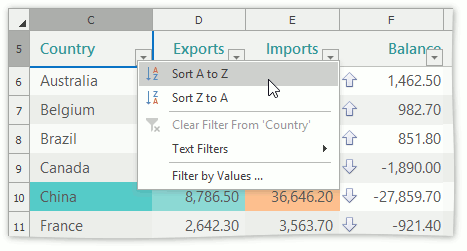

# Sort Data
The **Spreadsheet** provides the capability to sort data by text (**A to Z** or **Z to A**), numbers (**smallest to largest** or **largest to smallest**), dates and times (**oldest to newest** or **newest to oldest**) in one column.

To perform sorting, do the following.
1. Select a range in the column you wish to sort.
	
	> If multiple columns are selected, the range will be sorted by the **first** column.
2. On the **Data** tab, in the **Sort &amp; Filter** group, click **Sort A to Z** to select ascending order, or click **Sort Z to A** for descending order.
	
	

## Sort a Table
To sort data in a table, follow the steps below.
1. Click the arrow  in the header of the column by which data will be sorted.
2. In the drop-down menu, select the **Sort A to Z** item to select ascending order, or select the **Sort Z to A** item to select descending order.
	
	

All the records in the table will be reordered accordingly. The tiny arrow  appears in the column header to indicate that data in the table are sorted by this column.

> You cannot sort a table by more than one column at a time. When you apply a new sort order, it replaces the previous one.