The **Spreadsheet** allows you to use data validation to impose restrictions on cells to prevent other users from entering incorrect values in validated cells. For example, you can create a drop-down list of allowed values, restrict the number of characters entered into a cell, validate data using spreadsheet formulas, display an error message, provide an input message explaining what values can be entered into cells, etc.

Data validation settings are located on the **Data** tab in the **Data Tools** group.

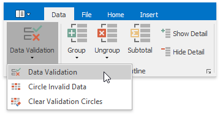

To configure data validation settings, use the <a name="dialog"/>**Data Validation** dialog, which can be invoked by clicking the **Data Validation** button and selecting the **Data Validation** item in the drop-down menu.

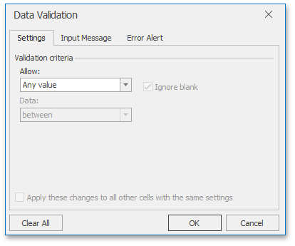

Select the action you wish to perform.
* [Restrict data entry to predefined items from a drop-down list](#list)
* [Restrict data entry to a whole or decimal number within a specified range](#wholenumber)
* [Restrict dates and times to values within a certain time interval](#dates)
* [Limit the number of text characters](#textlength)
* [Validate data based on formulas or values in other cells](#formula)
* [Create an input message](#inputmessage)
* [Create an error message](#errormessage)
* [Circle invalid data](#circledata)
* [Remove data validation](#removevalidation)

## <a name="list"/>Restrict Data Entry to Predefined Items from a Drop-Down List
1. [Select ](../../../../interface-elements-for-desktop/articles/spreadsheet/editing-cells/select-cells-or-cell-content.md) the cell or cell range you wish to validate.
2. Invoke the [Data Validation](#dialog) dialog.
3. On the **Settings** tab, in the **Allow** list, select the **List** item.
4. Enter a reference to the list of valid entries in the **Source** box. You can use a list of comma-separated values, [define a name](../../../../interface-elements-for-desktop/articles/spreadsheet/formulas/defined-names.md) for the cell range of valid entries, or [select](../../../../interface-elements-for-desktop/articles/spreadsheet/editing-cells/select-cells-or-cell-content.md) this cell range directly in the worksheet by using the **Collapse Dialog** button .
	 
	
	If you use a defined name or cell reference, precede it with an equal sign (&#61;).
	
	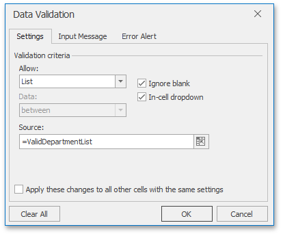
5. Verify that the **In-cell dropdown** check box is selected to display the drop-down menu in validated cells.
6. Select or clear the **Ignore blank** check box to specify whether or not to validate cells with empty values.
7. Click **OK** to close the dialog and apply the specified validation criterion.

As a result, the drop-down arrow appears to the right of a validated cell. Click the arrow to display the cell's drop-down list and select the required value.

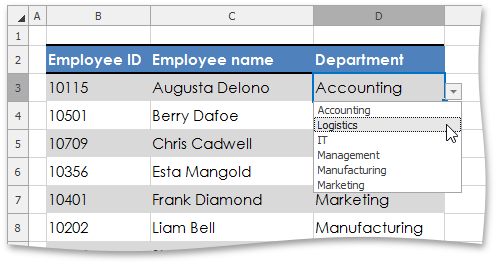

## <a name="wholenumber"/>Restrict Data Entry to a Whole or Decimal Number within a Specified Range
1. [Select ](../../../../interface-elements-for-desktop/articles/spreadsheet/editing-cells/select-cells-or-cell-content.md) the cell or cell range you wish to validate.
2. Invoke the [Data Validation](#dialog) dialog.
3. On the **Settings** tab, in the **Allow** list, select the **Whole number** or **Decimal** item.
4. Select the desired comparison operator in the **Data** list.
5. Depending on the selected operator, enter the required threshold values in the **Minimum**, **Maximum** or **Value** boxes. Note that you can also use a formula that returns a numeric value to calculate the threshold value. If you enter a formula, start it with an equal sign (=).
	
	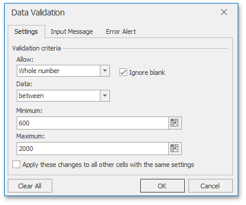
6. Click **OK** to close the dialog and apply the specified validation criterion.

## <a name="dates"/>Restrict Dates and Times to Values within a Certain Time Interval
1. [Select ](../../../../interface-elements-for-desktop/articles/spreadsheet/editing-cells/select-cells-or-cell-content.md) the cell or cell range you wish to validate.
2. Invoke the [Data Validation](#dialog) dialog.
3. On the **Settings** tab, in the **Allow** list, select the **Date** or **Time** item.
4. Select the desired comparison operator in the **Data** list.
5. Depending on the selected operator, provide the required values for the **Start date**, **End date** or **Date** boxes, if the **Date** option is selected (or for the **Start time**, **End time** or **Time** boxes in case of the **Time** option). Note that you can also use a formula that returns a date or time value to calculate the threshold value. If you enter a formula, start it with an equal sign (=).
	
	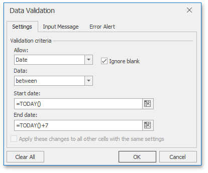
6. Click **OK** to close the dialog and apply the specified validation criterion.

## <a name="textlength"/>Limit the Number of Text Characters
1. [Select ](../../../../interface-elements-for-desktop/articles/spreadsheet/editing-cells/select-cells-or-cell-content.md) the cell or cell range you wish to validate.
2. Invoke the [Data Validation](#dialog) dialog.
3. On the **Settings** tab, in the **Allow** list, select the **Text length** item.
4. Select the desired comparison operator in the **Data** list.
5. Depending on the selected operator, enter the minimum, maximum, or particular text length in the **Minimum**, **Maximum** or **Length** boxes, respectively. Note that you can also use a formula that returns a numeric value to specify the allowable text length. If you enter a formula, start it with an equal sign (=).
	
	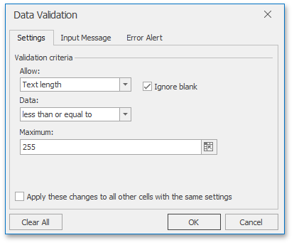
6. Click **OK** to close the dialog and apply the specified validation criterion.

## <a name="formula"/>Validate Data Based on Formulas or Values in Other Cells
1. [Select ](../../../../interface-elements-for-desktop/articles/spreadsheet/editing-cells/select-cells-or-cell-content.md) the cell or cell range you wish to validate.
2. Invoke the [Data Validation](#dialog) dialog.
3. On the **Settings** tab, in the **Allow** list, select the **Custom** item.
4. In the **Formula** box, enter a [formula](../../../../interface-elements-for-desktop/articles/spreadsheet/formulas/create-a-simple-formula.md) you wish to use as a validation criterion. Note that this formula should return a logical value: TRUE for valid values and FALSE for incorrect values. Your formula may also contain [cell references](../../../../interface-elements-for-desktop/articles/spreadsheet/formulas/cell-references.md), so that you can calculate the allowable values based on the content of other cells.
	
	For example, to restrict data entry for an Employee ID to a five-digit number, use the following formula: **=AND(ISNUMBER(B3),LEN(B3)=5)**.
	
	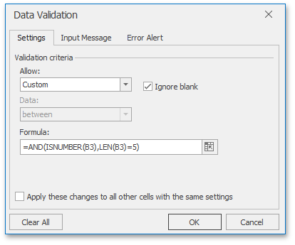
5. Click **OK** to close the dialog and apply the specified validation criterion.

## <a name="inputmessage"/>Create an Input Message
Once you apply data validation to cells, you can create an _input message_, which represents a descriptive message explaining what values can be entered into validated cells. Each time a validated cell is selected, a yellow text box appears near the cell displaying the input message.

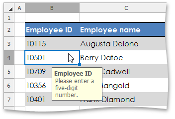

To create an input message, do the following.
1. Invoke the [Data Validation](#dialog) dialog.
2. Switch to the **Input Message** tab.
3. Verify that the **Show input message when cell is selected** check box is selected.
4. Specify the message title in the **Title** box, and enter the detailed message text in the **Input Message** box.
	
	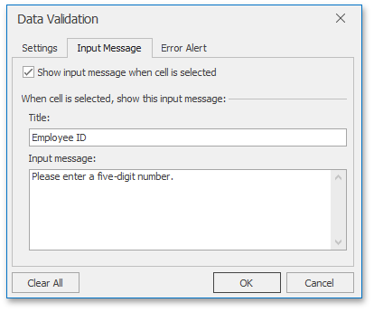
5. Click **OK** to close the dialog and add the specified input message to validated cells.

## <a name="errormessage"/>Create an Error Message
In addition to an [input message](#inputmessage), you can also specify an error message that will be displayed when a user enters an incorrect value into a validated cell.

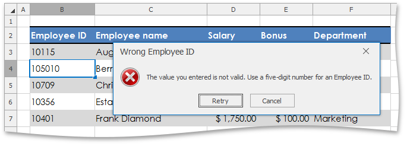

There are three types of error messages.
* **Stop** - specifies that users are not allowed to enter invalid data in a validated cell. The **Stop** message contains two buttons: the **Retry** button enables users to edit the invalid entry, while the **Cancel** button rejects it and rolls back to the previous cell value.
* **Warning** - allows users to enter an incorrect value in a validated cell, but warns them that the specified value is invalid. The **Warning** message contains three buttons: clicking **Yes** allows users to accept the invalid value, **No** enables them to edit the invalid entry, and **Cancel** rolls back to the previous cell value.
* **Information** - informs users that they entered an incorrect value and allows them to accept this value by clicking **OK**, or reject it by clicking **Cancel**.

Unless you specify the error message, the **Spreadsheet** will use the **Stop** error alert with the default text. To customize the error text and provide other users with a more informative message, do the following.
1. Invoke the [Data Validation](#dialog) dialog.
2. Switch to the **Error Alert** tab.
3. Verify that the **Show error alert after invalid data is entered** check box is selected.
4. Select the type of the error message in the **Style** list.
5. Specify the caption for the error alert window in the **Title** box, and enter the error description in the **Error Message** box.
	
	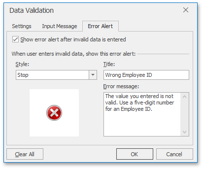
6. Click **OK** to close the dialog.

Note that if you use error messages that do not prevent the entry of incorrect values (**Warning** or **Information**), you can identify invalid data in your document by displaying [validation circles](#circledata).

## <a name="circledata"/>Circle Invalid Data
The **Spreadsheet** allows you to highlight invalid values entered into validated cells. To do this, on the **Data** tab, in the **Data Tools** group, click **Data Validation** | **Circle Invalid Data**.

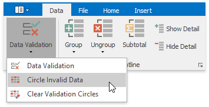

As a result, red circles will appear around cells containing incorrect values.

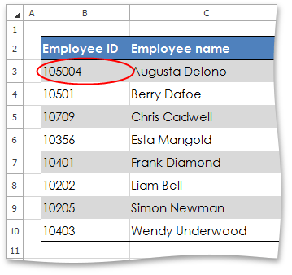

Once you identified invalid values, you can hide validation circles again. Do one of the following.
* Enter a value that meets the validation criterion in the cell. In this case, the validation circle will disappear automatically.
* On the **Data** tab, in the **Data Tools** group, click **Data Validation** | **Clear Validation Circles**.

## <a name="removevalidation"/>Remove Data Validation
To remove data validation criteria, perform the steps below.
1. [Select ](../../../../interface-elements-for-desktop/articles/spreadsheet/editing-cells/select-cells-or-cell-content.md) the cells which you wish to stop validating.
	
	> To quickly select all cells to which data validation is applied, on the **Home** tab, in the **Editing** group, click **Find &#38; Select** | **Data Validation**.
2. Invoke the [Data Validation](#dialog) dialog.
3. Do one of the following.
	* If you are prompted to erase current validation settings and continue, click **OK**, and then click **OK** in the invoked **Data Validation** dialog.
		
		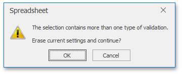
	* In the invoked **Data Validation** dialog, on the **Settings** tab, click the **Clear All** button.
		
		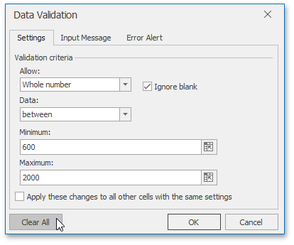