The **Spreadsheet** allows you to define a descriptive **name** for an individual cell, cell range, function, or constant value to make it easier to understand the information contained in worksheet formulas.
* [Defined Name Overview](#overview)
* [Defined Name Scope](#definednamescope)
* [Syntax Rules for Names](#rules)
* [Create a Name Using the Name Box](#namebox)
* [Create a Name Using the New Name Dialog](#newnamedialog)
* [Create Names from Selection](#namefromselection)
* [Mange Names Using the Name Manager Dialog](#namemanager)
* [Use Names in Formulas](#namesinformulas)
* [Delete Names](#deletename)

## Defined Name Overview<a name="overview"/>
A defined name is a meaningful shorthand name that describes the meaning of an individual cell, cell range, function, or constant value. Each defined name contains the following information.
* **Name**
	
	Indicates an individual cell, range of cells, formula or constant. Usually, a name explains the purpose of an object to which this name refers, making it easier to find and use this object.
	
	When specifying a name, you must take into account special [syntax rules](#rules).
* **Refers To**
	
	A string specifying a reference to a cell or cell range, formula or constant associated with the defined name. For example:
	
	_"=Sheet1!$D$20"_ - refers to the D20 cell located on the Sheet1 worksheet;
	
	_"=Sheet1!$A$1:$C$10"_ - refers to the A1:C10 range of cells located on the Sheet1 worksheet;
	 
	
	_"=SUM(Sheet1!$B$1:$B$10)"_ - refers to the formula that calculates the sum of values contained in the B1:B10 range of cells located on the Sheet1 worksheet;
	
	_"=10.5"_ - refers to a constant value.
	
	By default, defined names use [absolute cell references](../../../../interface-elements-for-desktop/articles/spreadsheet/formulas/cell-references.md), including worksheet names.
* **Comment**
	
	An explanation or additional information accompanying the defined name. The comment length cannot exceed 255 characters.

## <a name="definednamescope"/>Defined Name Scope
Each defined name has a scope - an area (individual worksheet or entire workbook) where the name is recognized and can be used without qualification. For example, a defined name (_cellName_) whose scope is the first worksheet of a workbook (_Sheet1_) is recognized without qualification in this worksheet only (e.g., _=5+cellName_). To use this defined name in other worksheets, precede it with the name of the worksheet to which the defined name belongs (e.g., _"=5+Sheet1!cellName"_). If the scope of a defined name (_cellName_global_) is an entire workbook, this name is recognized in any worksheet of this workbook (e.g., _"=5+cellName_global"_).

> Each name must be unique in its scope.

If the defined name is not found, the cell that uses this name displays the **#NAME?** [error](../../../../interface-elements-for-desktop/articles/spreadsheet/formulas/error-types-in-formulas.md).

## <a name="rules"/>Syntax Rules for Names
When you create or modify a defined name, follow these rules.
* Start a name with a letter, an underscore symbol ("_") or a backslash ("\"). Other characters in the name can be letters, numbers, periods and underscore symbols.
	
	Note that the single letters "C", "c", "R", or "r" cannot be used as defined names.
* A name cannot contain a cell reference (for example, "A1", "$M$15", etc.).
* A name cannot contain spaces (use underscore symbols and periods to separate individual words in a name).
* A name cannot be an empty string.
* The length of a name cannot exceed 255 characters.
* Names are case-insensitive, so that you are not allowed to create the _Products_ and _PRODUCTS_ names in one scope.

## <a name="namebox"/>Create a Name Using the Name Box
1. Select a cell or a range of cells for which you wish to define a name.
2. Type the name you want to use to refer to the selection in the **Name Box** located to the left of the **Formula Bar**. Press **ENTER**.
	
	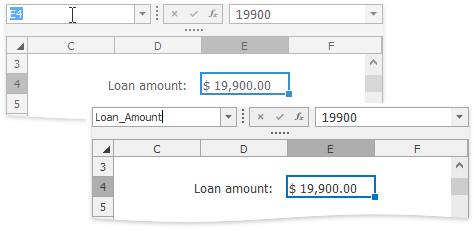
	
	Now you can quickly select the defined cell range by its name. To do this, click the drop-down arrow to the right side of the **Name Box**, and select the required name from the drop-down list.
	
	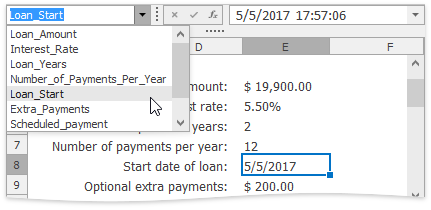

## <a name="newnamedialog"/>Create a Name Using the New Name Dialog
The **New Name** dialog gives you more flexibility for naming parts of your document. Using this dialog, you can name cell ranges, formulas and constants, and provide additional information for created names.
1. To invoke the **New Name** dialog, on the **Formulas** tab in the **Defined Names** group, click the **Define Name** button.
	
	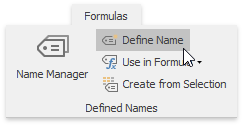
2. In the invoked dialog in the **Name** box, type a name to be associated with a cell or cell range, formula or constant.
	
	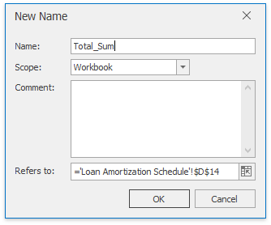
3. In the **Scope** drop-down list, select the scope of the defined name: specify whether a name should be accessible within an entire workbook or an individual worksheet only.
4. In the **Comment** box, enter a descriptive text for your defined name (optionally).
5. In the **Refers to** box, type a cell reference, formula or constant for which you wish to define a name.
	
	By default, when you invoke the **New Name** dialog, the current selection is displayed in the **Refers to** box. However, you can enter another cell range by selecting it directly in the worksheet. To do this, click the **Collapse Dialog** button () to minimize the dialog and access the worksheet, select the appropriate cell range, and then click the **Expand Dialog** button () to restore the dialog's initial state.
	
	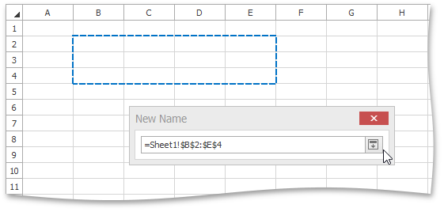
6. Click **OK** to finish creating the name.

## <a name="namefromselection"/>Create Names from Selection
The **Create Names from Selection** dialog allows you to automatically generate names for rows and columns in the selected range using the row and column labels.

To create a name from a selection, do the following.
1. Select a cell range to be named, including the row or column labels to be used for generating names.
2. On the **Formulas** tab in the **Defined Names** group, click the **Create from Selection** button, or press **CTRL**+**SHIFT**+**F3**.
	
	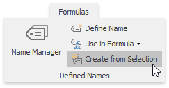
3. In the invoked **Create Names from Selection** dialog, specify which row (top or bottom) or column (left or right) contains labels that should be used for generating names, and click **OK**.
	
	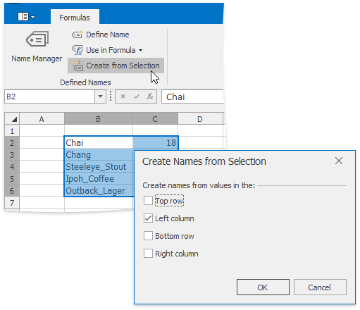

> Names generated using this approach do not include the row and column labels and refer only to the cells containing values.

## <a name="namemanager"/>Mange Names Using the Name Manager Dialog
The **Name Manager** dialog lists all the defined names specified in a workbook and allows you to [create](#newname) new names, [edit](#editname) and [delete](#deletename) existing names.

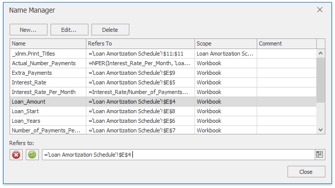

To invoke the **Name Manager** dialog, on the **Formulas** tab in the **Defined Names** group, click the **Name Manager** button.

* **Create a name**
	
	To define a new name, at the top of the **Name Manager** dialog, click the **New...** button. In the invoked [New Name](#newnamedialog) dialog, specify all necessary parameters for a new defined name.
* **Edit a name**
	
	To modify the existing name, select this name in the **Name** list, and at the top of the **Name Manager** dialog click the **Edit...** button, or double-click the name. In the invoked **Edit Name** dialog, modify the name itself, change the cell reference, formula or constant to which the name refers, or enter a new comment. Only the scope of the defined name cannot be changed.
	
	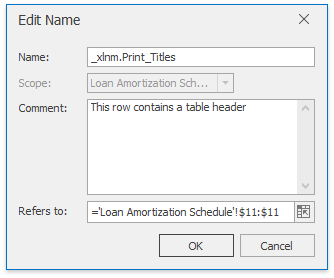
	
	If you wish to modify only the current reference for a name, you can do it directly in the **Name Manager** dialog. To do this, select the desired name in the **Name** list and type a new value in the **Refers to** box, or...
	
	
	
	... click the **Collapse Dialog** button () and select the desired range directly in the worksheet.

## <a name="namesinformulas"/>Use Names in Formulas
To insert an existing defined name into a formula, type the required name directly in the formula or select it from the **Use in Formula** list on the **Formulas** tab in the **Defined Names** group.

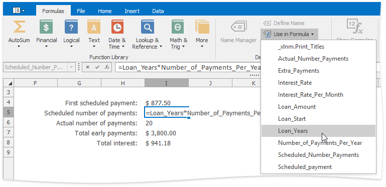

## <a name="deletename"/>Delete Names
To remove a defined name, do the following.
1. On the **Formulas** tab, in the **Defined Names** group, click the **Name Manager** button.
	
	
2. In the invoked **Name Manager** dialog, select the name you wish to delete.
3. Click the **Delete** button, or press **DELETE**.
	
	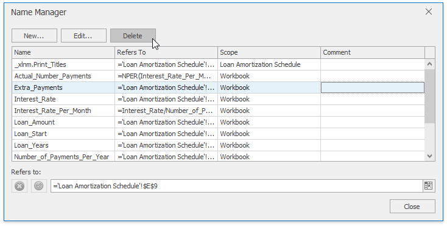