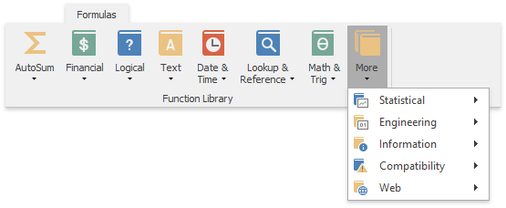

# Supported Functions
The **Spreadsheet** supports the following functions to be used in formulas.
* **Mathematical Functions** - used to perform common mathematical operations: addition (SUM), multiplication (PRODUCT), exponentiation (POWER), extraction of the square root (SQRT), evaluation of trigonometric functions (e.g., SIN, COS or TAN), etc.
* **Financial Functions** - used to perform various types of financial operations: calculation of interest rates (RATE), calculation of interest payments (IPMT), etc.
* **Logical Functions** - used to perform logical operations such as AND, OR, NOT, etc.
* **Text Functions** - used to provide operations with text data in cells, such as string concatenation (CONCATENATE), replacement of part of a string with another string (REPLACE), etc.
* **Date and Time Functions** - used to work with dates: to calculate the number of days, months, or years between two dates (e.g., DATEIF or DAYS360), or to add various components of a specified time to a worksheet (e.g., SECOND, MINUTE or HOUR).
* **Lookup and Reference Functions** - used for searching specific data in a worksheet: to look up values in vectors, arrays or references (e.g., LOOKUP or MATCH)
* **Statistical Functions** - used for data analysis: to find the average of a list of values (AVERAGE), to evaluate the covariance between two data sets (COVAR), to find the smallest or the largest value in a list of arguments (MAX, MIN), etc.
* **Engineering Functions** - used to work with special functions (e.g., BESSELI or BESSELJ), complex numbers (e.g., COMPLEX or IMAGINARY) and various numeral systems (e.g., DEC2BIN or BIN2DEC).
* **Information Functions** - used to provide information about the formatting, location or content of cells (e.g., CELL, INFO or ISTEXT).
* **Compatibility Functions** - replaced by new functions in Microsoft&#174; Excel&#174; versions 2010 and higher. These functions can be used to provide compatibility with earlier versions of Microsoft&#174; Excel&#174;.
* **Web Functions** - used to return a URL-encoded string (ENCODEURL).

All of the functions described above are available in the **Function Library** group within the **Formulas** tab.

