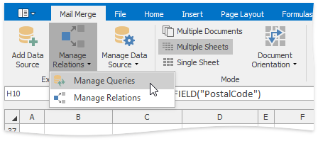
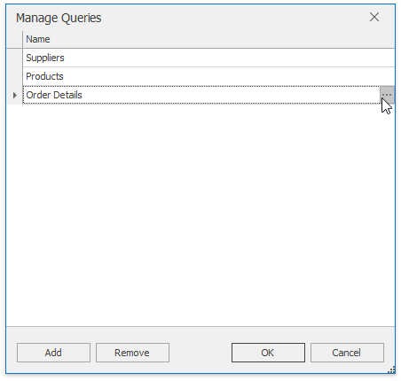
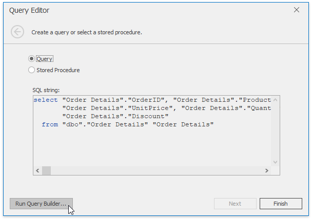
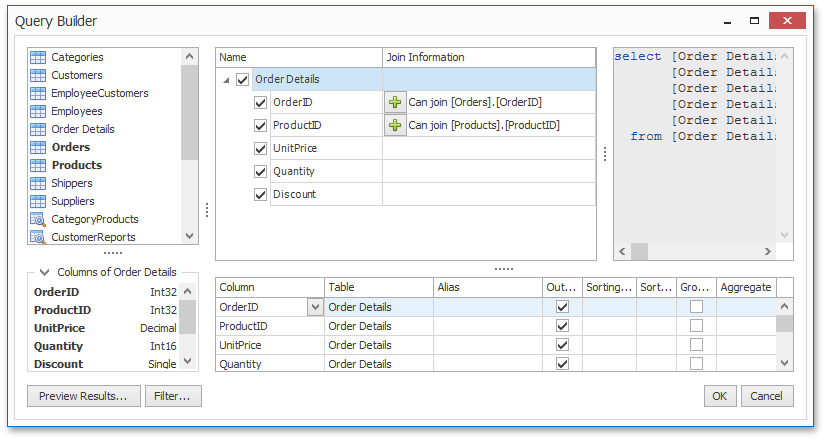

# Query Builder
When the data source is configured, you can use the built-in **Query Builder** dialog to select required data.

To invoke the **Query Builder** window, select the **Manage Queries** item from the **Manage Relations** drop-down menu.

In the **Manage Queries** dialog, click the ellipsis button in the query list to edit the selected query.

The **Query Editor** window appears.
 

To modify the query, invoke the **Query Builder** window by clicking the **Run Query Builder...** button.

To add a data table to the query, drag the required table from the list of available tables on the left and drop it onto the list of data tables to be used. Select the check box near the field to include this field in the query. A _green plus_ symbol near the field indicates that you can join tables using this field.

Click **Preview Results...** to invoke a dialog displaying the first 1000 records of the resulting table.

Click the **Filter...** button in the **Query Builder** to invoke the **Filter Editor** window that allows you to specify a filtering criterion or create a parametrized query.

For more information on parameters, review the [Parameters Panel](../../../../interface-elements-for-desktop/articles/spreadsheet/mail-merge/parameters-panel.md) document.

When all the necessary changes are made, click **OK** to close the window and save the query in the document.

> All queries are stored in an .xls or .xlsx file. You can save the workbook after creating the data source. Subsequently, you can start performing a mail merge immediately after the XLSX/XLS file is loaded into the Spreadsheet control.