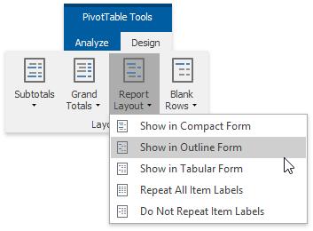
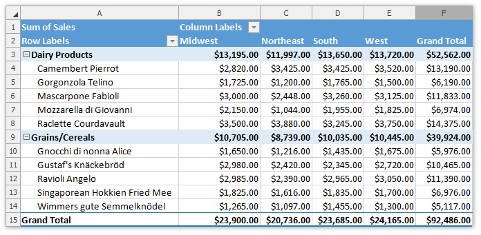
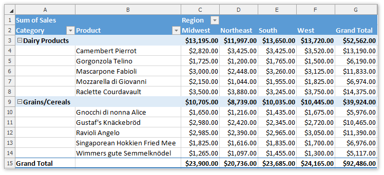
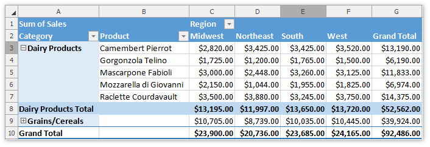
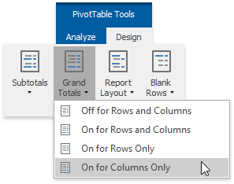
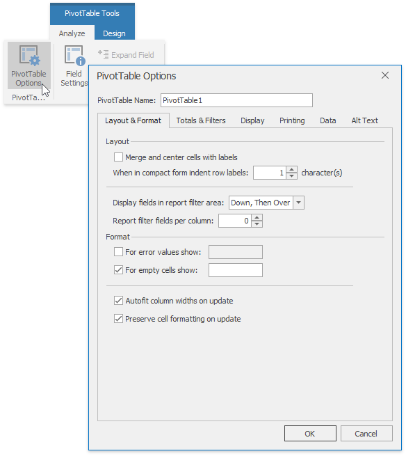
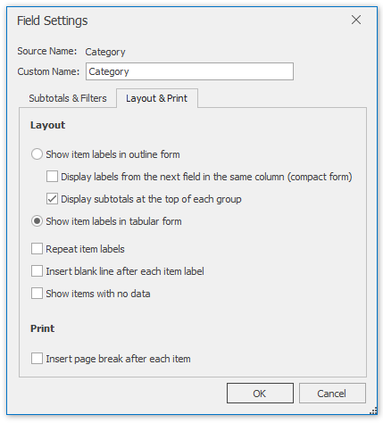

This topic describes how to specify the layout options for the entire PivotTable report or a specific [row field](#rowfield) only. 

## Change the PivotTable Layout
1. To change the PivotTable layout, on the **PivotTable Tools** | **Layout** tab, in the **Layout** group, click the **Report Layout** button.
	
	
2. The invoked drop-down menu allows you to apply one of the following layout forms.
	* **Compact Form** - the default layout. The report is compressed to prevent data from spreading horizontally off the screen.
		
		
	* **Outline Form** - the report data is outlined.
		
		
	* **Tabular Form** - the pivot table is shown in the table format.
		
		
3. For the outline and tabular forms, you can enable repeating item labels in the outer row fields. To do that, select the **Repeat All Item Labels** item in the **Report Layout** drop-down menu. To disable repeating, select **Do Not Repeat Item Labels**.
4. You can also specify whether to show/hide subtotals and grand totals in the PivotTable report, or insert the blank line after each item in the outer row fields. To do that, on the **PivotTable Tools** | **Layout** tab, in the **Layout** group, click the **Subtotals**, **Grand Totals** or **Blank Rows** button, respectively, and select the desired action from the drop-down menu.
	
	
5. The advanced layout options can be specified using the **Layout &amp; Format** tab of the **PivotTable Options** dialog. To invoke it, click the **PivotTable Options** button in the **PivotTable** group.
	
	

<a name="rowfield"/>

## Change the Field Layout
* You can change the layout options for the specific row fields only. To do that, select a row field and on the **PivotTable Tools** | **Analyze** tab, in the **Active Field** group, click the **Field Settings** button.
	
	
* In the invoked **Field Settings** dialog, switch to the **Layout &amp; Print** tab.
	
	
* To show field items in tabular or outline form, select the corresponding option in the **Layout** section. To display field items in compact form, select **Show item labels in outline form** and then click the **Display labels from the next field in the same column (compact form)** check box.

The **Field Settings** dialog also allows you to specify whether to repeat item labels for an outer field, insert the blank line after each field item, or show items with no data. To do that, select the corresponding check boxes in the **Layout** section.