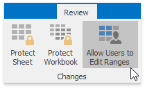
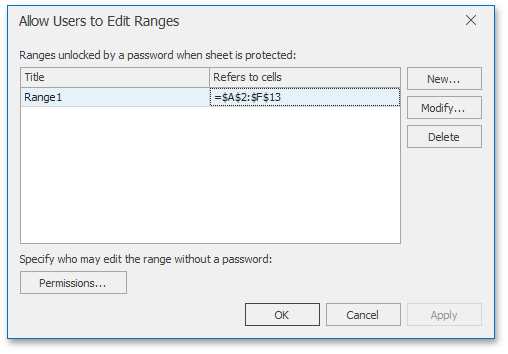
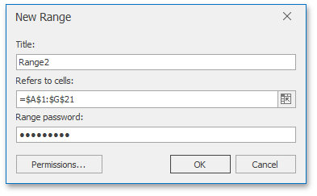
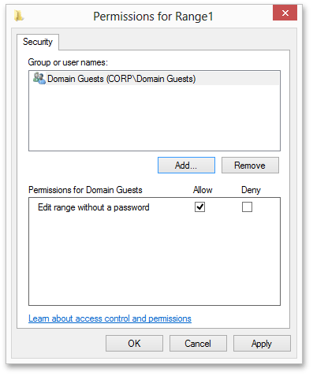

In a protected worksheet, all locked cells are read-only.  However, you can unlock certain ranges for users who provide the correct password. You can also specify user accounts and groups who can edit specific ranges without a password.

To accomplish this task, invoke the **Allow Users to Edit Ranges** dialog. On the **Review** tab, in the **Changes** group, click **Allow Users to Edit Ranges**.

The **Allow Users to Edit Ranges** dialog is shown in the picture below.

Click the **New...** button to display a dialog to specify the worksheet range and password, as illustrated below.

The **Permissions...** button allows you to specify Active Directory users and groups.

After all required permissions and password-protected ranges are specified, apply protection to the worksheet to activate permissions as described in the [Protect a Worksheet](../../../../interface-elements-for-desktop/articles/spreadsheet/protection/protect-a-worksheet.md) document.

When attempting to edit a cell content in a protected range for which a permission is specified, you will be prompted for a password if your user account is not listed in the Permissions dialog for that range or if the account does not belong to the user group listed in that dialog.