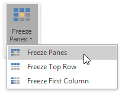
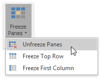

To keep specific columns and rows of the worksheet visible while scrolling through the rest of the worksheet, lock them in place using the **Freeze Panes** options of the **Spreadsheet**.

To freeze specific row(s) or column(s), follow the instructions below.
1. Depending on what you wish to freeze, do one of the following.
	* To lock a row(s), [select](../../../../interface-elements-for-desktop/articles/spreadsheet/editing-cells/select-cells-or-cell-content.md) the row below the row(s) you wish to freeze.
	* To lock a column(s), [select](../../../../interface-elements-for-desktop/articles/spreadsheet/editing-cells/select-cells-or-cell-content.md) the column to the right of the column(s) you wish to freeze.
	* To lock a row(s) and column(s) simultaneously, click the cell below the row(s) and to the right of the column(s) you wish to freeze.
2. In the **Window** group within the **View** tab, click the **Freeze Panes** button's drop-down.
	
	
	
	Select one of the following.
	* **Freeze Panes** - lock multiple columns and/or multiple rows simultaneously.
	* **Freeze Top Row** - lock the first row only.
	* **Freeze First Column** - lock the left column only.
	
	A black border appears beneath the frozen row(s) and to the right of the frozen column(s).
3. To unfreeze a row(s) or column(s), click the **Unfreeze Panes** item from the **Freeze Panes** button's drop-down list. This unlocks all frozen rows and columns in the worksheet.
	
	