You can highlight certain column cells that meet a specific condition using the **Conditional Formatting** menu. To invoke this menu, right-click the column to which a formatting rule should be applied and select **Conditional Formatting**.

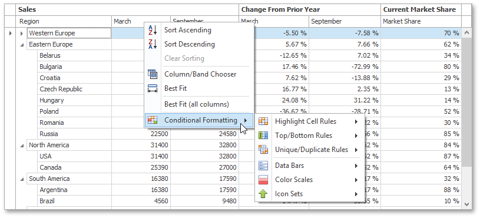

Available format rules are displayed when expanding the **Conditional Formatting** menu. Different options are supported for different columns (depending on the type of data a clicked column displays).

## Highlighting Cells that Meet a Specific Condition
* Choose the **Highlight Cell Rules** menu item. 
	
	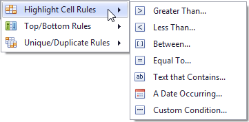
* Select the condition type. You can use one of the predefined conditions (the **Greater Than...**, **Less Than..**, **Between...** and **Equal To...** menu items), provide a custom condition (the **Custom Condition..** item) or format cells that contain the specified text (**Text that Contains...**) or refer to a certain date interval(s) (**A Date Occurring...**).
* Based on the selected condition type, an appropriate dialog window is invoked. You need to either enter a constant to be compared with the column's values, or select desired check boxes related to dates, or construct a custom condition in the dedicated editor. After that, choose a format style in the dropdown list, and click the **OK** button. To apply formatting to an entire row instead of a single cell, select the corresponding check box.
	
	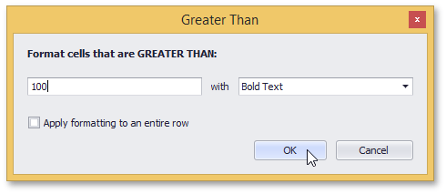

## Highlighting Top or Bottom Cell Values
* Choose the **Top/Bottom Rules** menu item. 
	
	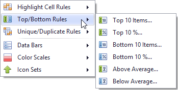
* Select the rule type. You can highlight cells that contain the highest or lowest values (the **Top 10%...**, **Bottom 10%...**, **Top 10 Items...** and **Bottom 10 Items...** menu items), and values that are above or below the column's average (**Above Average** and **Below Average**).
* According to the selected rule type, an appropriate dialog window is invoked. Enter a cutoff value (where required), choose a format style in the dropdown list, and click the **OK** button. To apply formatting to an entire row instead of a single cell, select the corresponding check box.
	
	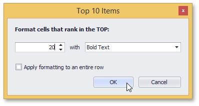

## Highlighting Unique or Duplicate Cell Values
* Choose the **Unique/Duplicate Rules** menu item. 
	
	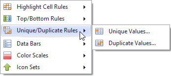
* Select the rule type.
* In the invoked dialog window, choose a format style in the dropdown list, and click the **OK** button. To apply formatting to an entire row instead of a single cell, select the corresponding check box.
	
	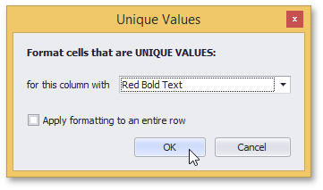

## Highlighting Cells Using Data Bars
A data bar fills a cell according to the ratio of the cell's value to the highest and smallest column values. A longer bar corresponds to a higher value, and a shorter bar corresponds to a lower value.

To apply a data bar format, do the following:
* Choose the **Data Bars** menu item. 
	
	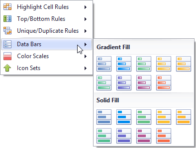
* Select the bar style format. Solid bars and bars with gradient fills are available in various colors.

## Applying Color Scales
This format shows data distribution and variation using color scales. A cell is filled with the background color that is calculated according to the ratio of the cell's value to the highest and smallest column values.
A two-color scale specifies two colors, which represent the minimum and maximum column values. Cell values residing between the minimum and maximum values are painted using a shade of these colors. A three-color scale additionally defines a color for the middle value and so, uses a gradation of three colors.
* Choose the **Color Scales** menu item. 
	
	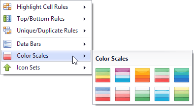
* Select one of the predefined two or three-color scales.

## Highlighting Cells Using Predefined Icons
Icon sets allow you to classify column values into several ranges separated by threshold values, and display a specific icon in a column cell according to the range to which this cell value belongs. In the **Positive/Negative** group, the available icon sets divide column values into three ranges: positive values, negative values and values equal to zero.

Other icon sets divide column values into three, four or five ranges, displaying a specific icon for each range. If an icon set contains three icons, the ranges are as follows: [0%-33%), [33%-67%) and [67%-100%], where 0% corresponds to the smallest column value and 100% corresponds to the largest column value. The icon sets with four icons classify column values into four ranges: [0%-25%), [25%-50%), [50%-75%) and [75%-100%]. For the icon sets that contain five icons, the target ranges are: [0%-20%), [20%-40%), [40%-60%), [60%-80%) and [80%-100%].
* Choose the **Icon Sets** menu item. 
	
	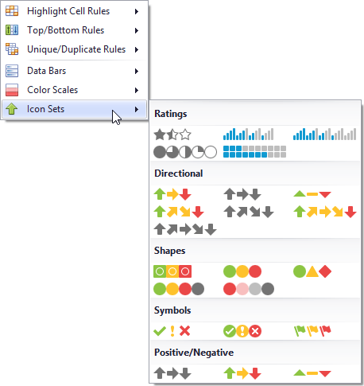
* Select one of the predefined icon sets.

## Deleting Rules
If you have already applied one or more rules to columns, the additional **Clear Rules** item is displayed at the second level of the **Conditional Formatting** menu.

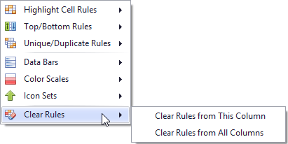

You can do one of the following.
* To delete conditional formatting rules from the target column, click the **Clear Rules from This Column** menu item. If the column has no rules applied to it, this item is not shown.
	
	or
* To delete formatting rules from all columns, click the **Clear Rules from All Columns** menu item .