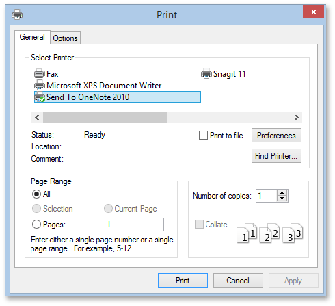

# Print Reports Using the Native Functionality of a Web Browser
If the PDF plug-in is not installed or is disabled in your web browser, the report document is printed using the native functionality of this browser.

When you click either the **Print the report**  or **Print the current page**  button, the browser invokes its **Print** dialog and prints the document's layout as it is displayed by the Document Viewer without converting it to PDF. The following image illustrates the **Print** dialog of Microsoft&#174; Internet Explorer.

The printing engine of a web browser can affect report printing by assigning custom print settings (such as kind of paper, margins, etc.) to a document. This makes it impossible to guarantee consistent report printing. To properly print the report in this case, you need to manually specify all print settings. Moreover, since the Document Viewer displays one report page at a time, a web browser only prints the currently displayed page along with the rest of the irrelevant web page content.

To secure consistent printing results, as well as avoid routinely evaluating print settings prior to each printing operation, [install the Adobe Reader plug-in](install-and-activate-the-adobe-reader-plug-in-for-printing-in-a-web-browser.md).