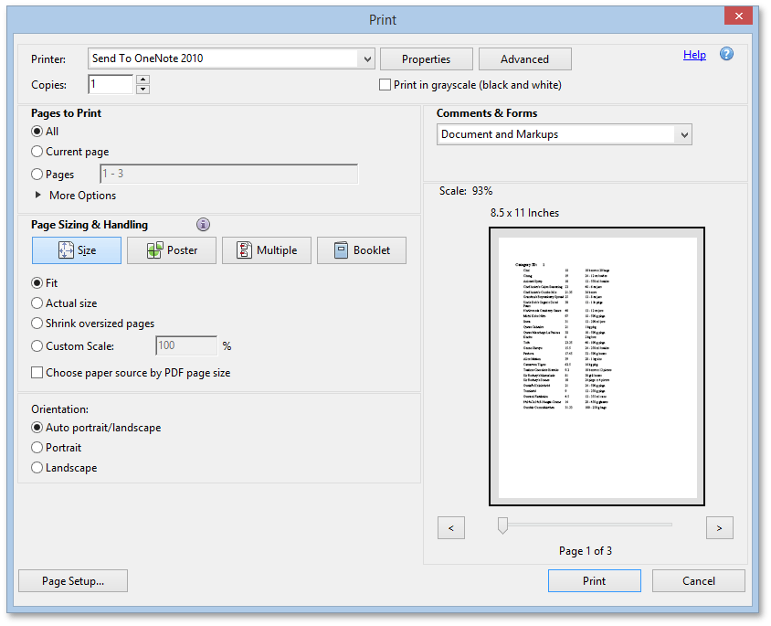

# Printing
The Web Document Viewer supports pixel perfect document rendering, i.e., displays a report document exactly how it will appear on paper. The printing functionality of this Viewer is based on rendering the report in PDF with special settings and invoking the PDF plug-in's **Print** dialog.

To print the entire document, click the **Print**  button on the Viewer's toolbar. You can also print the currently displayed document page by clicking the **Print Page**  button.

When you click any of these buttons, the Document Viewer tries to use the PDF plug-in of the web browser for printing. Depending on the plug-in detection result, there are two possible scenarios.
* If the PDF plug-in is installed and enabled, its **Print** dialog is invoked. To print the document, specify the required settings in this dialog and click **Print**.
* If the PDF plug-in is disabled or is not installed, the Document Viewer exports the report document to a PDF file, and initiates its download instead of printing. The resulting PDF file contains a script that starts printing the document immediately after it is opened in a compatible viewer.

The following image shows the **Print** dialog of the **Adobe Reader&#174;** plug-in.

To download and install the **Adobe Reader&#174;** plug-in, use the following link: [http://get.adobe.com/reader/](http//get.adobe.com/reader/). No software other than the **Adobe Reader&#174;** should be installed on the machine for printing purposes. After finishing the installation, the plug-in should automatically be enabled in appropriate web browsers. To learn how to manually setup your browser to use this plug-in, refer to the [Display PDF in browser](https//helpx.adobe.com/acrobat/using/display-pdf-in-browser.html) document. For the changes to take effect, you may need to close and reopen your browser.

Note that many modern web browsers include their own PDF plug-ins, which automatically replace the **Adobe Reader&#174;** plug-in. If you need to revert to the **Adobe** plug-in, refer to [Configure browser to use the Adobe PDF plug-in](https//helpx.adobe.com/acrobat/kb/pdf-browser-plugin-configuration.html).