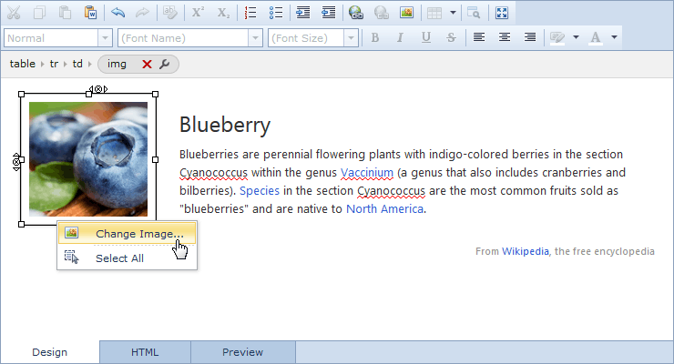
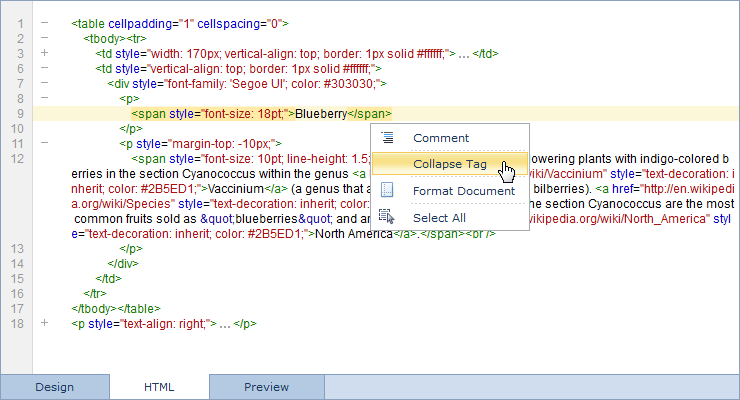

# View Modes
The HTML Editor can operate in three modes: [Design mode](#designmode), [HTML mode](#htmlmode), and [Preview mode](#previewmode). You can switch between modes by using the tab headers.

## <a name="designmode"/>Design Mode
**Design Mode** allows you to modify editor content using various design tools, and instantly see the results.

In this view, the editor can display the following elements.
* [Toolbar](../../../../interface-elements-for-web/articles/html-editor/html-editor-user-interface/toolbar.md) or [Ribbon](../../../../interface-elements-for-web/articles/html-editor/html-editor-user-interface/ribbon.md)
* [Context Menu](../../../../interface-elements-for-web/articles/html-editor/html-editor-user-interface/context-menu.md)
* [Tag Inspector](../../../../interface-elements-for-web/articles/html-editor/html-editor-user-interface/tag-inspector.md)

## <a name="htmlmode"/>HTML Mode
**HTML Mode** allows you to modify editor content using HTML markup.

## <a name="previewmode"/>Preview Mode
**Preview Mode** allows you to view editor content as a regular webpage.

