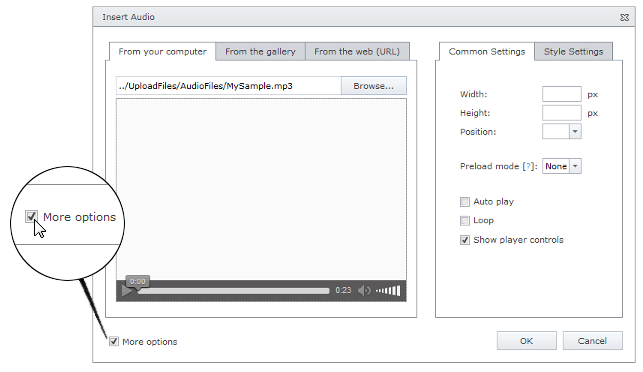
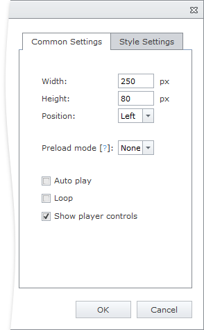

# Audio Settings
When you [insert](insert-an-audio-into-html-editor.md) or [modify](modify-audio-settings-in-html-editor.md) audio in an HTML Editor, you can customize the audio player settings as well.

To display the settings section in an audio dialog, select the **More options** check box.

The displayed section contains the following settings, which you can use to customize the audio player.

## Common Settings Tab

* **Width** - specifies the width of the audio player in pixels.
* **Height** - specifies the height of the audio player in pixels.
* **Position** - specifies the position of the audio player.
* **Preload mode** - specifies how the audio file should be loaded when the page loads.
	* _None_ - the browser does not load the audio when the page loads.
	* _Metadata_ - the browser loads only metadata when the page loads.
	* _Auto_ - the browser loads the entire audio when the page loads.
* **Auto Play** - specifies whether or not the audio will automatically start playing.
* **Loop** - specifies whether or not the audio will start over again every time it is finished.
* **Show player controls** - specifies whether or not the audio player controls should be displayed.

## Style Settings Tab

* **Margin top** - specifies the audio player top margin in pixels.
* **Margin bottom** - specifies the audio player bottom margin in pixels.
* **Margin left** - specifies the audio player left margin in pixels.
* **Margin right** - specifies the audio player right margin in pixels.
* **Border width** - specifies the width of the audio player border in pixels.
* **Border color** - specifies the color of the audio player border.
* **Border style** - specifies the style of the audio player border.
* **CSS class** -  specifies the CSS class applied to the audio player.