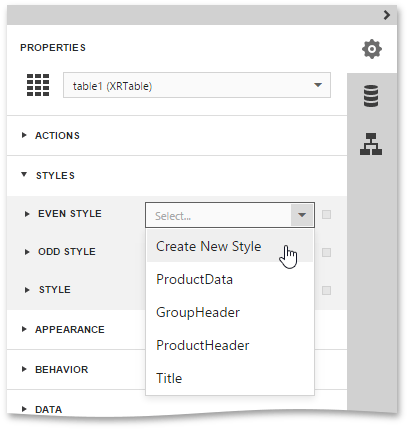
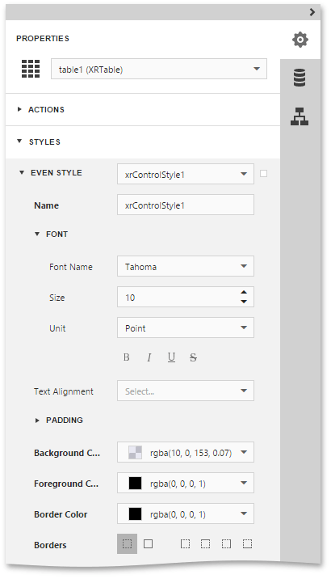
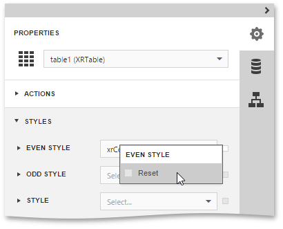
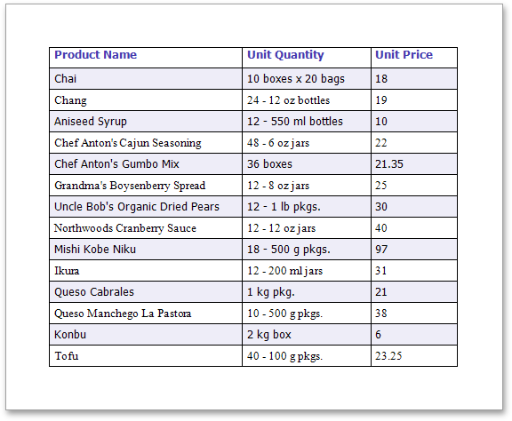

# Use Odd and Even Styles
This document describes how to apply [odd and even styles](understanding-style-concepts.md) to [report controls](../../report-elements/report-controls.md), e.g., to alternate the background color for each record.

To utilize odd and even styles, do the following.
1. Create a [table report](../../report-types/table-report.md).
2. Select the detail table and in the [Properties Panel](../../interface-elements/properties-panel.md), expand the **Styles** category. Then, invoke the drop-down list for the **Even Style** property and click **Create New Style**.
	
	
	
	This will create a style and assign it to the control's **Even Style**.
3. Now, expand the **Even Style** section and adjust the required options of the newly created style (e.g. specify the **Font** and **Background Color** properties).
	
	

If required, perform the same steps, to create and assign an odd style, as well.

To reset all style properties of a report control to their default values, select the control, click the **Advanced Options** button for the required style (marked with the 'square'  icon) and in the invoked popup menu select **Reset**.

Switch your report to the [Preview](../../document-preview.md) mode, and view the result.

