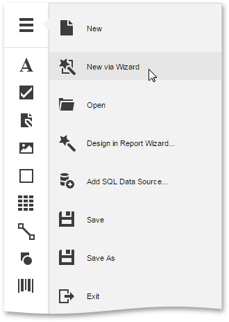
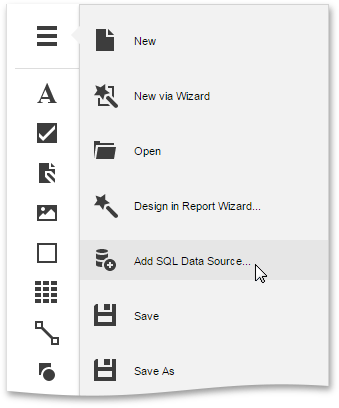
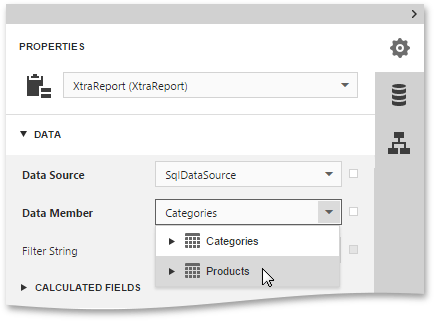

# Bind a Report to Data
The [Web Report Designer](../../../report-designer.md) is primarily designed to work with _data-aware reports_, which means that a report obtains its general (_dynamic_) data from an external _data source_. This document describes how to _bind_ a report to a data source.

The document consists of the following sections.
* [Use an Existing Data Source](#existing)
* [Create a New Data Source](#new)

## <a name="existing"/>Use an Existing Data Source
Since the Web Report Designer allows you to work with the currently opened report, you can [recreate](../basic-operations/create-a-new-report.md) this report and bind it to data, using an existing data source. To do this, run the [Report Wizard](../../wizards/report-wizard.md).

The Report Wizard includes several steps, and depending on how many steps are completed (you don't necessarily have to go through all the pages), you can bind a report to data, apply data grouping, display totals, etc. The [Report Wizard](../../wizards/report-wizard.md) topic provides you with information about the steps of the wizard.

## <a name="new"/>Create a New Data Source
You can also create a new data source and configure it, using the [SQL Data Source Wizard](../../wizards/sql-data-source-wizard.md).

Note that the **SQL Data Source Wizard** is only available if your software provider explicitly enabled this functionality by supplying the Web Report Designer with a set of default data connections.

For more information on how to use the SQL Data Source Wizard, see the [SQL Data Source Wizard](../../wizards/sql-data-source-wizard.md) topic.

After binding a report to data, the [Field List](../../interface-elements/field-list.md) shows the structure of the report's data source. Fields from the Field List can be dropped onto the report to [create data-aware controls](bind-report-controls-to-data.md) of the appropriate type.

When a bound data source contains more than one data table, you can specify the data table from which your report obtains its data. To do this, specify the report's **Data Member** property.

