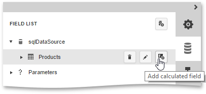
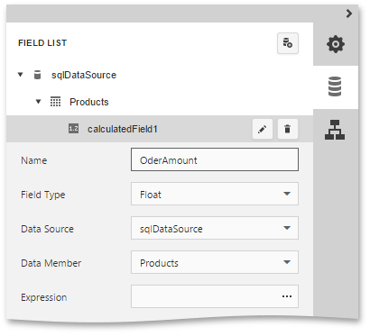
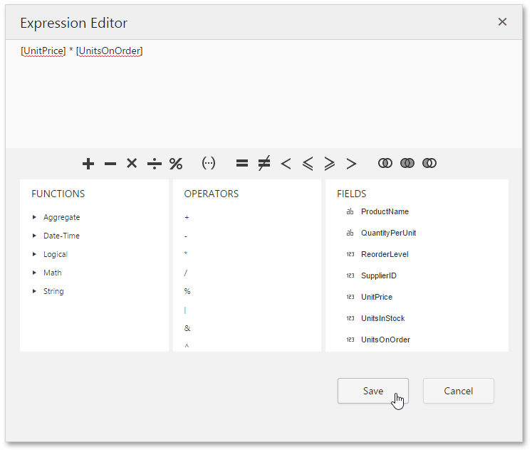
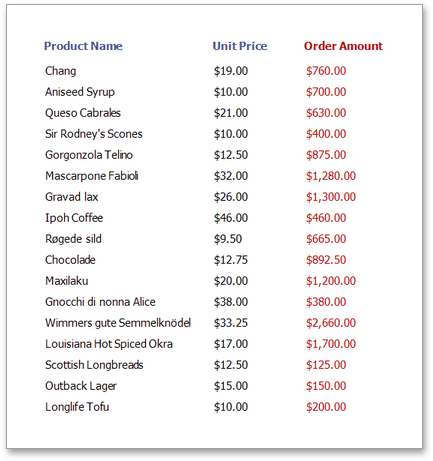

# Calculated Fields
This document describes how _calculated fields_ can be used in your report. The main purpose of calculated fields is to perform pre-calculations (of virtually any level of complexity) over [data fields](bind-a-report-to-data.md) based on a specific expression. So, using calculated fields allows you to apply complex expressions to one or more data fields that are obtained from your report's underlying data source.

In the [Web Report Designer](../../../report-designer.md), a calculated field is similar to an ordinary data field (e.g., you can [bind controls](bind-report-controls-to-data.md) to it, and [group](../shaping-data/grouping-data.md), [sort](../shaping-data/sorting-data.md) and [filter](../shaping-data/filtering-data.md) your report against it).

To add a calculated field to your report, follow the instructions below.
1. Create a calculated field. To do this, switch to the [Field List](../../interface-elements/field-list.md) panel, click a data table and the click **Add calculated field** button.
	
	
2. To specify calculated field properties, click the **Edit** button (the 'pencil' icon ) for this calculated field. Among its options, make sure to change the **Field Type** property to an appropriate value.
	
	
3. The value of a calculated field is obtained by evaluating its expression, which is specified by its **Expression** property. To create an expression for the calculated field, click the ellipsis button for the Expression property. Then, construct the required expression in the invoked [Expression Editor](../../interface-elements/expression-editor.md).
	
	
	
	To add a data field or [report parameter](report-parameters.md) to this expression, double-click the required name in the **Fields** list. A data field is inserted into the expression's text using its name in **[**square brackets**]**, and parameters are inserted using the "**Parameters.**" prefix before their names.
	
	To add operators between field names, use the toolbar or **Operators** list. To perform different string, date-time, logical, and math operations over data, use standard functions from the **Functions** list.
4. Now, you can use the calculated field as a typical data field, e.g., drop it from the [Field List](../../interface-elements/field-list.md) to create a [Label control](../../report-elements/report-controls.md) bound to this field, or even group, sort and filter your report against it.
	
	For example, create the following report.
	
	
5. The report with a calculated field is now ready. Switch your report to the [Preview](../../document-preview.md) mode and view the result.
	
	