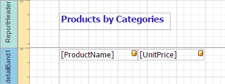
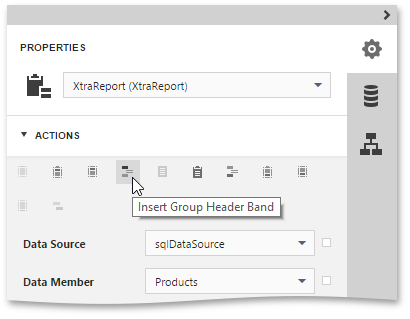
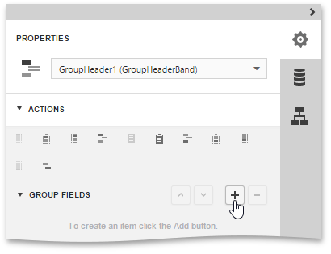
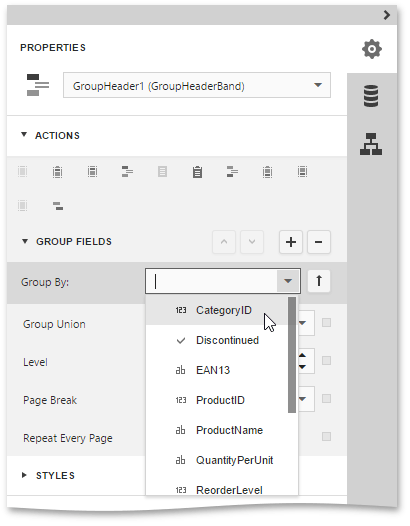
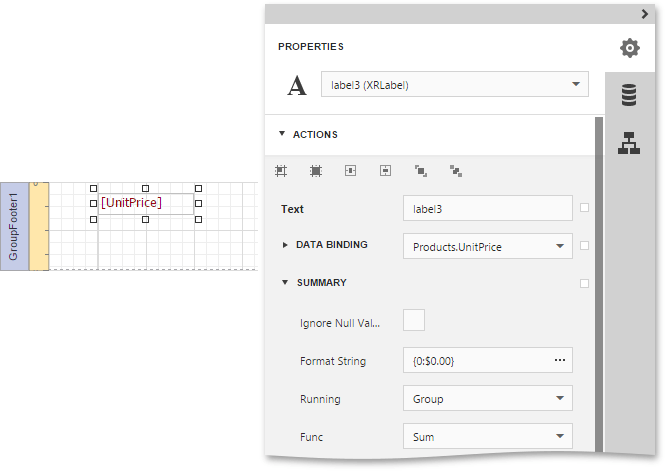
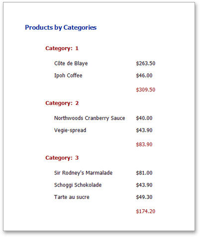

# Grouping Data
This topic provides a sample that illustrates how to group report data. Grouping allows you to split data into groups based on identical values in a field or fields. Note that grouping can only be applied to [bound reports](../../../../../interface-elements-for-web/articles/report-designer/creating-reports/providing-data/bind-a-report-to-data.md).

To group records in a report, do the following.
1. [Create a new report](../../../../../interface-elements-for-web/articles/report-designer/creating-reports/basic-operations/create-a-new-report.md) and [bind it to a data source](../../../../../interface-elements-for-web/articles/report-designer/creating-reports/providing-data/bind-a-report-to-data.md). This tutorial starts with the following report.
	
	
2. Switch to the [Properties Panel](../../../../../interface-elements-for-web/articles/report-designer/interface-elements/properties-panel.md) and [add](../../../../../interface-elements-for-web/articles/report-designer/creating-reports/basic-operations/create-report-elements.md) a Group Header band to the report by clicking the corresponding button in the **Actions** category.
	
	
3. Select the [Group Header band](../../../../../interface-elements-for-web/articles/report-designer/report-elements/report-bands.md) and expand the **Actions** or **Behavior** category. Then, in the **Group Fields** section, click the **Add** button to add a new grouping.
	
	
4. Next, choose a data member across which the report is to be grouped. Note that grouping across [calculated fields](../../../../../interface-elements-for-web/articles/report-designer/creating-reports/providing-data/calculated-fields.md) is supported as well.
	
	
	
	To manage the sorting order of the group's items, use the corresponding arrow button. The  and  icons indicate the ascending and descending sorting order, respectively. To disable sorting in grouped data, click this button until it is marked with the  icon.
5. Drop the data field, which is specified as the grouping criterion, from the [Field List](../../../../../interface-elements-for-web/articles/report-designer/interface-elements/field-list.md) panel onto the Group Header band. Now, this data field will be displayed as a header for each group.
	
	
6. You can also [calculate a total](../../../../../interface-elements-for-web/articles/report-designer/creating-reports/shaping-data/calculating-summaries.md) across the group by placing a [Label](../../../../../interface-elements-for-web/articles/report-designer/report-elements/report-controls.md) onto the Group Footer band, and specify its **Summary** properties in the following way.
	
	
	
	Note also that _value formatting_ is applied to a summary independently of general formatting and has a greater priority.

The grouping is now applied. Switch your report to the [Preview](../../../../../interface-elements-for-web/articles/report-designer/document-preview.md) mode and view the result.

