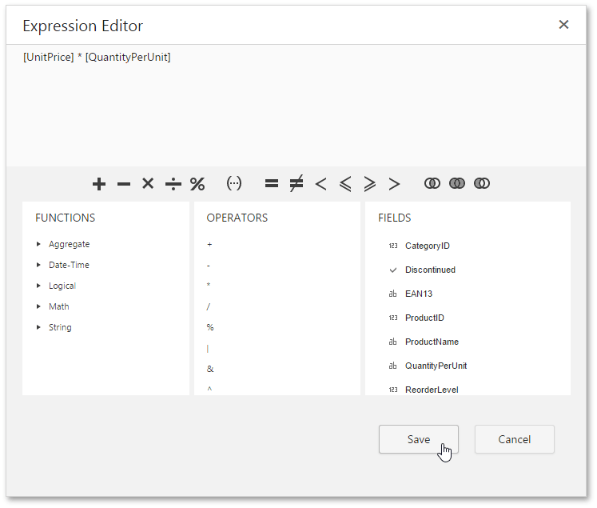
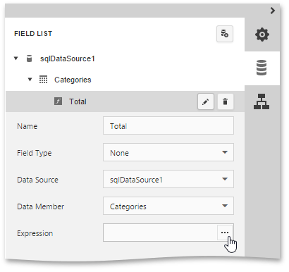
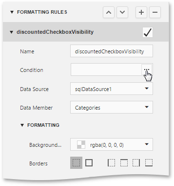

# Expression Editor
The **Expression Editor** provides the capability for constructing expressions in the [Web Report Designer](../../report-designer.md).

This topic consists of the following section.
* [Expression Editor Overview](#overview)
* [Expression Syntax](#syntax)
* [Using the Expression Editor](#using)

## <a name="overview"/>Expression Editor Overview
The Expression Editor's visual interface allows you to type an expression manually or select predefined functions, operators and operands. The editor supports a variety of aggregate, date-time, logical, math and string functions. You can also use logical and arithmetic operators and fields of a data source to which a report is bound.

After you finish constructing an expression, click **Save**. If an expression contains any errors, the  icon appears meaning that the expression should be rewritten.

## <a name="syntax"/>Expression Syntax
The following syntax conventions should be taken into account when using the Expression editor.
* A data field is referenced in the expression by enclosing its name in square brackets (e.g., **[ProductName]**).
* Report parameters are inserted using the "Parameters." prefix before their names (e.g., **[Parameters.parameter1]**).
* String values are denoted with apostrophes. To embed an apostrophe into an expression's text, type a double apostrophe (e.g., **'It''s sample text'**).
* Date-time constants should be enclosed with hashtags (e.g., **[OrderDate] >= #1/1/2016#**).
* To specify a null reference (one that does not refer to any object), use a question mark (e.g., **[Region] != ?**).
* If an expression involves the use of different types, you can convert them to the same type using dedicated functions (e.g., **Max(ToDecimal([Quantity]),[UnitPrice])**).

## <a name="using"/>Using the Expression Editor
Expressions can be used for calculating [query parameters](../creating-reports/providing-data/query-parameters.md) and [calculated fields](../creating-reports/providing-data/calculated-fields.md) values as well as for specifying conditions of [formatting rules](../creating-reports/appearance-customization/conditionally-change-a-controls-appearance.md).
* To edit an expression for a calculated field, access its settings in the [Field List](field-list.md) and click the ellipsis button for the **Expression** property.
	
	
* To specify an expression for a query parameter, in the [Configure Query Parameters](../wizards/sql-data-source-wizard/adding-a-new-data-source/configure-query-parameters.md) wizard page, set the parameter type to **Expression** and click the ellipsis button for the **Value** property.
	
	
* To construct a condition for a formatting rule, access its settings in the **Properties** panel and click the ellipsis button for the **Condition** property.
	
	
	
	If the specified expression does not return a **Boolean** value, the error  icon appears on an attempt to save the condition.