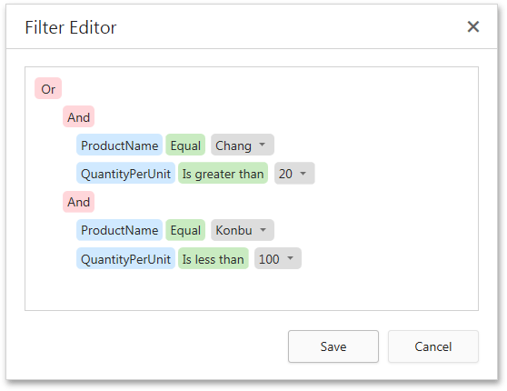
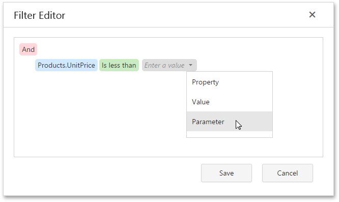

# Filter Editor
The **Filter Editor** provides a visual interface for constructing filter criteria of any complexity with an unlimited number of filter conditions combined by logical operators.

To invoke this editor to filter report data, expand the **Actions** or **Data** category in the [Properties Panel](../../../../interface-elements-for-web/articles/report-designer/interface-elements/properties-panel.md) panel and click the ellipsis button for the report's **Filter String** property.

The Filter Editor displays filter criteria as a tree where individual nodes specify simple filter conditions. Specific conditions can be arranged into groups with **And**, **Or**, **Not And**, and **Not Or** operators. The root node is the logical operator combining all conditions.

The image below shows the filter expression that contains two groups combined by the **Or** logical operator.

Any filter condition consists of three parts.
* The name of a field of a data source to which a report is bound.
* Criteria operator, such as **Equals**, **Is less than**, **Is between**, etc.
* Operand value.

You can also compare a data field with another data field or a report parameter. To do this, expand the drop-down menu for a value placeholder and select **Value** or **Parameter**.

This will convert the value placeholder into a field placeholder or parameter placeholder, respectively. Then, click the placeholder and select the required item.