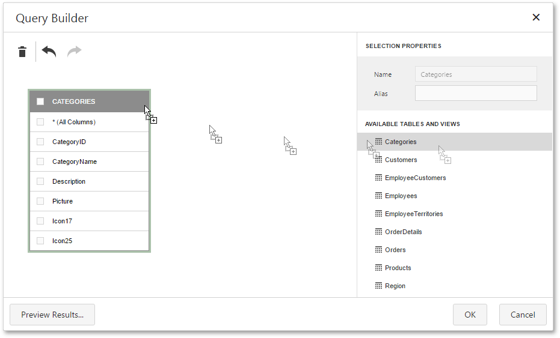
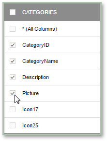
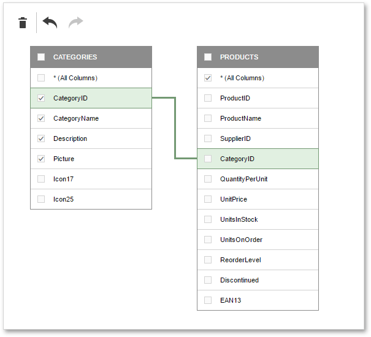
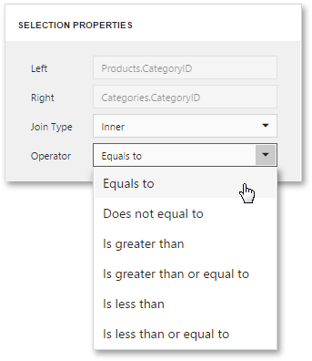
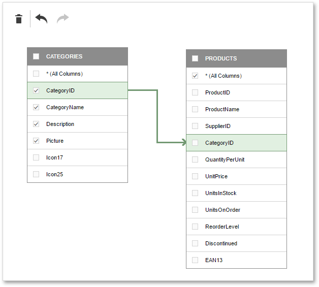
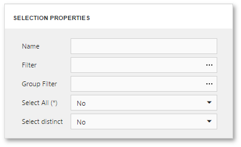
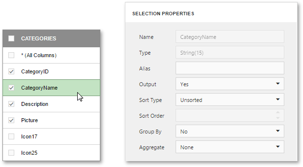
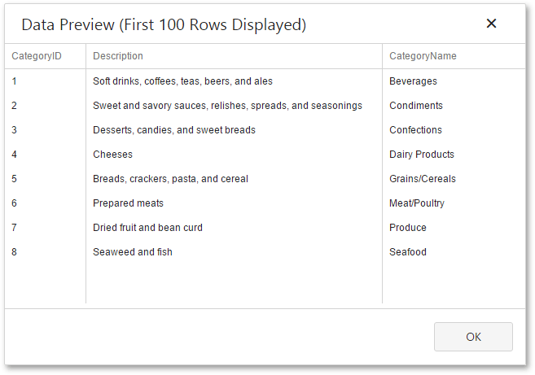

# Query Builder
The **Query Builder** can be invoked from the [SQL Data Source Wizard](../../../../interface-elements-for-web/articles/report-designer/wizards/sql-data-source-wizard.md). It provides a visual editor to create custom queries and enables you to solve a variety of tasks.
* [Select Tables](#select)
* [Join Tables](#join)
* [Filter Data](#filter)
* [Shape Data](#shape)
* [Preview Results](#preview)

## <a name="select"/>Select Tables
To include a specific table into a query result set, drag and drop it onto the Query Builder design surface.

The Query Builder provides a toolbar with the following commands.

| Icon | Description |
|---|---|
|  | Removes the selected table or view from the query. |
|  | Reverses the most recent action. |
|  | Performs the action that has previously been undone. |

For each table or view that has been added, you can select which specific columns to include into the query result set by using the corresponding check boxes.

## <a name="join"/>Join Tables
To join separate tables and/or views, connect their corresponding columns (key fields) using drag and drop. The connected columns must have identical data types.

Clicking the data relation will display the corresponding properties that define the join type (**Inner** or **Left Outer**) and applied logical operator.

A left outer join returns all the values from an inner join along with all values in the "left" table that do not match to the "right" table, including rows with NULL (empty) values in the key field.

When the left outer join is selected, the relationship line displays an arrow pointing at the "right" table of the join clause.

After executing the query, it will return a "flat" table composed of data records selected based on the specified join options.

> Although joining different tables within a single query may be required in some scenarios, creating [hierarchical data sources](../../../../interface-elements-for-web/articles/report-designer/interface-elements/master-detail-relation-editor.md) generally results in better performance (in general, [master-detail reports](../../../../interface-elements-for-web/articles/report-designer/report-types/master-detail-report.md) are generated faster than similar-looking reports created by grouping "flat" data sources).

## <a name="filter"/>Filter Data
Clicking the Query Builder surface will display the query options.

The following options are available.
* **Name**
	
	Specifies a custom query name (alias).
* **Filter**
	
	Runs the [Filter Editor](../../../../interface-elements-for-web/articles/report-designer/interface-elements/filter-editor.md) where you can specify filter criteria against which the query result set should be narrowed down.
* **Select All (*)**
	
	Specifies whether or not the query result set should include all columns from the selected tables and/or views, regardless of their individual settings.
	
	This option is set to **No** by default.

## <a name="shape"/>Shape Data
Clicking a data column of a selected table or view will display the data column options.

The following options are available.
* **Name**
	
	Indicates the column name by which it is referred to in the database.
* **Type**
	
	Indicates the type of data contained in the column.
	
	String columns are provided with information about the maximum string length.
* **Alias**
	
	Specifies a custom column name (alias).
	
	This option is available only for columns that are included into a query.
* **Output**
	
	Specifies whether or not the column is included into the query result set.
* **Sort Type**
	
	Specifies whether to preserve the original order of data records within the column, or sort them (in an ascending or descending order).
* **Sort Order**
	
	This option becomes available after applying sorting to the data column's records.
	
	It defines the priority in which sorting is applied to multiple columns (the less this number is, the higher the priority).
	
	For example, if column **A** has the sort order set to **1** and column **B** has it set to **2**, the query will be first sorted by column **A** and then by the column **B**.
	
	Changing this setting for one column automatically updates the sort order of other columns to avoid conflict of priorities.
* **Group By**
	
	Specifies whether or not the query result set should be grouped by this column.
	
	> Grouping and/or aggregation can only be applied to each of the selected columns.
* **Aggregate**
	
	Specifies whether or not the column's data records should be aggregated.
	
	The following aggregate functions are supported: **Count**, **Max**, **Min**, **Avg**, **Sum**.
	
	Applying any of these functions to a column will discard individual data records from the query result set, which will only include the aggregate function result.
	
	> Grouping and/or aggregation can only be applied to each of the selected columns.

## <a name="preview"/>Preview Results
You can test a query at any time on a limited subset of the actual data by clicking the **Preview Results** button.

This will open the **Data Preview** screen displaying the query result set limited by the first **100** data records.

