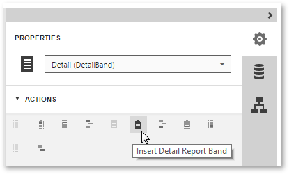
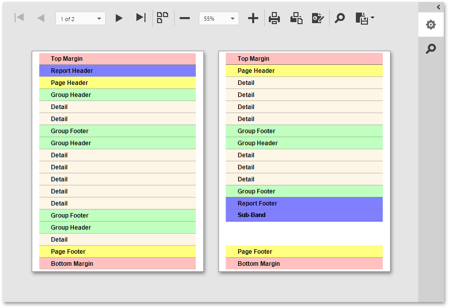

# Report Bands
A _Report Band_ represents a specific area on a report page, where [report controls](report-controls.md) are contained. A band is used to define how to render report controls that belong to it. In the [Web Report Designer](../../report-designer.md),  every report consists of a number of bands, each of a different type.

This document consists of the following sections.
* [Adding Bands](#adding)
* [Available Bands](#bands)
* [Positions of Band Types](#position)

## <a name="adding"/>Adding Bands
To add a new band to a report, select the report or any of its bands in the **Properties** panel and click an appropriate item in the **Actions** category.

## <a name="bands"/>Available Bands
The following table lists the band types.

| Icon | Description |
|---|---|
|  | The **Top Margin** band represents the top page margin. It is intended for displaying [page numbers](../creating-reports/add-details-about-a-report/add-page-numbers-and-system-information-to-a-report.md), or some sort of supplementary information (e.g. [current system time](../creating-reports/add-details-about-a-report/add-page-numbers-and-system-information-to-a-report.md) or the [user name](../creating-reports/add-details-about-a-report/add-page-numbers-and-system-information-to-a-report.md)). |
|  | The **Report Header** is located at the beginning of a report. This band is intended to display some introductory information, e.g., a cover page for a report (the report's name, company logo, [date of creation and user name](../creating-reports/add-details-about-a-report/add-page-numbers-and-system-information-to-a-report.md), etc.) And, if you plan to add a [Chart](../report-types/chart-with-static-series.md) that visualizes the report's data, place this control onto this band. |
|  | The **Page Header** band is located at the top of every page, below the **Top Margin** or **Report Header** band. This band is intended to display page numbers or a table header, continued from the previous page. |
|  | The **Group Header** band is located at the beginning of every group or at the top of the page if it is split across pages. This band specifies grouping criteria and is used to display information at the beginning of a group of records. To learn more, refer to [Grouping Data](../creating-reports/shaping-data/grouping-data.md). |
|  | The **Detail** band is located on a page between all other bands. This band cannot be deleted - the present report structure includes the Detail band in its core. In a [data-bound report](../creating-reports/providing-data/bind-a-report-to-data.md), the contents of the Detail band are repeated for every data entry. And, if static data is also present in the Detail band, it is repeated with each new entry in the resulting report. For more information about data binding, refer to [Providing Data](../creating-reports/providing-data.md). |
|  | The **Detail Report Band** is located below the **Detail** band and is intended to hold the detail report when creating a [master-detail report](../report-types/master-detail-report-(detail-report-bands).md). There can be an unlimited number of Detail Report bands nested inside one another. To learn more about detail reports, refer to [Master-Detail Report (Detail Report Bands)](../report-types/master-detail-report-(detail-report-bands).md). |
|  | The **Group Footer** band is located at the end of every group or at the bottom of the page if this group is split across pages. This band is primarily intended to show summary information for a group. |
|  | The **Report Footer** finalizes the informative part of the report. It is placed before the **Page Footer** and **Bottom Margin** on the report's last page. This band is intended to display some final information, e.g., report totals. |
|  | The **Page Footer** band is located at the bottom of every page, below the **Report Footer** and above the  **Bottom Margin** band. This band is intended to display page numbers or a table footer, which is continued on the following page. |
|  | The **Bottom Margin** band represents the bottom page margin. It is intended for displaying [page numbers](../creating-reports/add-details-about-a-report/add-page-numbers-and-system-information-to-a-report.md), or some sort of supplementary information (e.g., [current system time](../creating-reports/add-details-about-a-report/add-page-numbers-and-system-information-to-a-report.md) or the [user name](../creating-reports/add-details-about-a-report/add-page-numbers-and-system-information-to-a-report.md)). |
|  | The **Sub-Band** provides a functional copy of the source band below which it is located. A sub-band's behavior, as well as its position within the report band hierarchy, is dictated by the source band type. Any number of sub-bands can be added to the report band of any type, except for the **Top Margin** and **Bottom Margin** bands and the sub-band itself. |

## <a name="position"/>Positions of Band Types
The following image illustrates the relative positions of different band types, and how many times they are rendered in a report.

The **Page Header**, **Page Footer**, **Top Margin** and **Bottom Margin** bands are rendered in the report preview on every page.

The **Report Header** and **Report Footer** bands are rendered in the report preview only once.

The **Group Header** and **Group Footer** bands are rendered for every group of records in a report.

The number of times the **Detail** band is rendered in a report depends upon the number of records returned from the bound data source - one band per record.

To learn how to create a report band and change its layout, refer to [Create Report Elements](../creating-reports/basic-operations/create-report-elements.md) and [Adjust the Layout of Report Elements](../creating-reports/basic-operations/adjust-the-layout-of-report-elements.md).