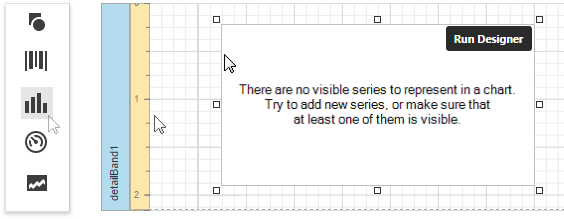
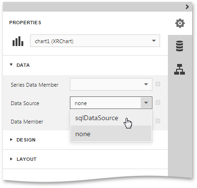
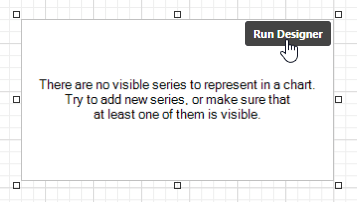
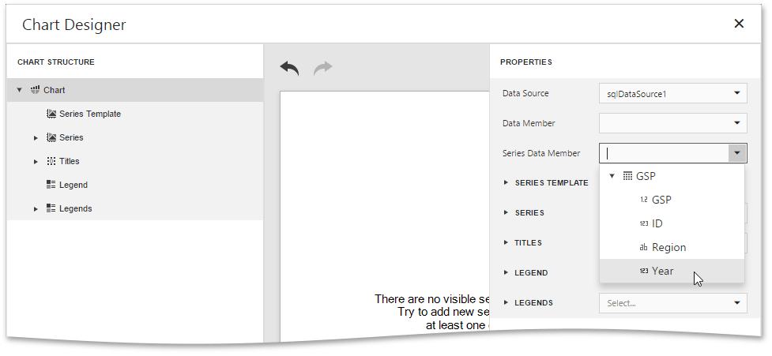
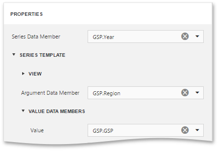
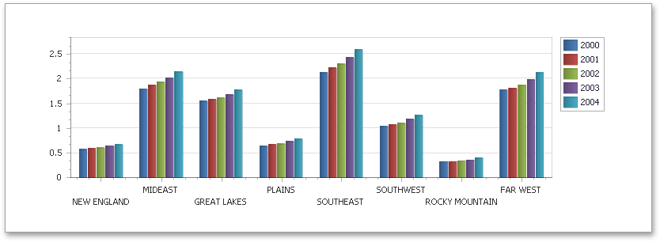

# Chart with Dynamic Series
This document describes how to create a report with a [Chart control](../../../../interface-elements-for-web/articles/report-designer/report-elements/report-controls.md) bound to data so that all series are automatically created based on a common template, which specifies universal options for all series.

To adjust a Chart with automatically created series, do the following:
1. [Create a new report](../../../../interface-elements-for-web/articles/report-designer/creating-reports/basic-operations/create-a-new-report.md) and [bind it to a data source](../../../../interface-elements-for-web/articles/report-designer/creating-reports/providing-data/bind-a-report-to-data.md).
2. Drop the [Chart control](../../../../interface-elements-for-web/articles/report-designer/report-elements/report-controls.md) from the [Toolbox](../../../../interface-elements-for-web/articles/report-designer/interface-elements/toolbox.md) onto the report's [Detail band](../../../../interface-elements-for-web/articles/report-designer/report-elements/report-bands.md).
	
	
3. To bind the Chart to a data source, in the [Properties Panel](../../../../interface-elements-for-web/articles/report-designer/interface-elements/properties-panel.md), expand the **Data** category and specify the **Data Source** property.
	
	
	
	> Set the report's **Data Source** property to **None** after placing the Chart in the Detail band. Otherwise, the Chart repeats at the preview as many times as there are records in the data source.
	> 
	> 
4. Select the Chart control once again and click the **Run Designer** button displayed over it.
	
	
5. In the invoked **Chart Designer**, select the **Chart** node in the **Chart Structure** tree and switch to the **Properties** panel. Use the **Series Data Member** property to specify the data field that should provide data for the series names (so that it creates a new series for each record in that data field).
	
	
6. Expand the **Series Template** option and use the **Argument Data Member** and **Value Data Members** properties to define from where to obtain data for point arguments and values.
	
	

At this step, the chart's data options are completely defined. It is also possible to customize other Chart properties.

Switch your report to the [Preview](../../../../interface-elements-for-web/articles/report-designer/document-preview.md) mode to view the result.

