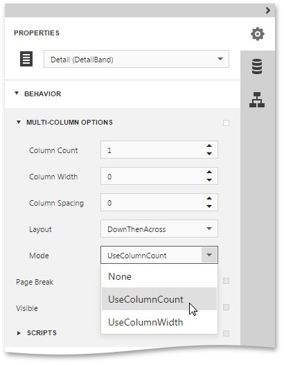
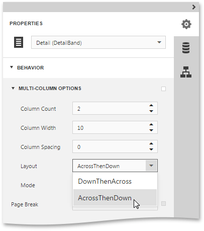
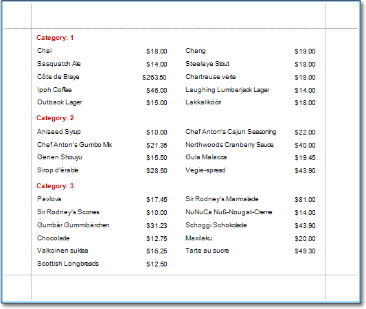

# Multi-Column Report
This tutorial describes the steps to create a _multi-column report_, meaning that each page of the report document is laid out in a specified number of columns.

To demonstrate the multi-column feature, we'll use a report with grouping, similar to the one created in the [Grouping Data](../../../../interface-elements-for-web/articles/report-designer/creating-reports/shaping-data/grouping-data.md) tutorial.
1. Select the [Detail band](../../../../interface-elements-for-web/articles/report-designer/report-elements/report-bands.md), and in the [Properties Panel](../../../../interface-elements-for-web/articles/report-designer/interface-elements/properties-panel.md), expand the **Actions** or **Behavior** category.
	
	Then, expand the **Multi-Column Options** section and set the required **Mode**. It determines whether the number of columns is manually specified or if it depends on the fixed column width.
	
	
2. Then, if you've chosen to **Use Column Count**, set the **Column Count** to **2**, and **Column Spacing** to **10**.
	
	The **Layout** determines the order in which records of the same group are processed.
	
	
3. Now, on the Detail band's surface, a grey area appears, delimiting the available column's width. Adjust the controls width, so that they fit within the effective borders.
	
	

The multi-column report is now ready. Switch your report to the [Preview](../../../../interface-elements-for-web/articles/report-designer/document-preview.md) mode, and view the result.

