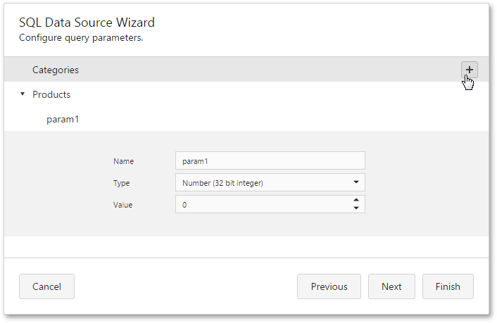
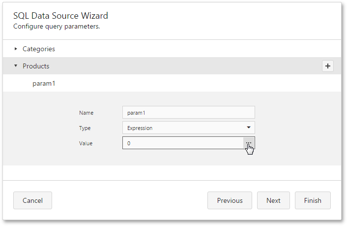

# Configure Query Parameters
This page is displayed if any custom queries and/or parameterized stored procedures were selected on the [previous wizard page](create-a-query-or-select-a-stored-procedure.md).

On this page, you can manage parameters that are used in queries and/or stored procedures and specify parameter values.

To add a new parameter, select a query and click the  button.

To delete a parameter, click the  button.

To customize an existing parameter, click the  button.

Next, you can specify the parameter name, type and value.

When the parameter type is set to **Expression**, the value editor displays the ellipsis button, and clicking on it invokes the [Expression Editor](../../../interface-elements/expression-editor.md).

To link a query parameter to an existing report parameter, type the report parameter name using the following syntax: **[parameters.parameter1]**.

Click **Next** to proceed to the next wizard page: [Configure Master-Detail Relationships](configure-master-detail-relationships.md).

> When invoking the SQL Data Source Wizard to edit an existing data source, [another version](../editing-an-existing-data-source/create-a-query-or-select-a-stored-procedure.md) of this page is displayed.
> 
> This version is also shown if your software vendor switched the SQL Data Source Wizard to the single-query mode.