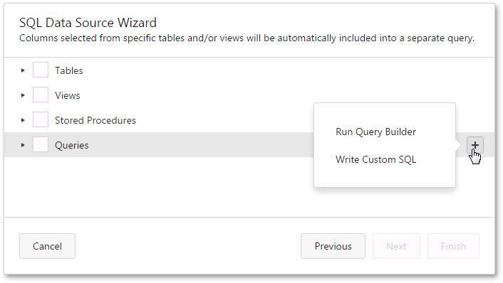

# Create a Query or Select a Stored Procedure
On this wizard page, you can choose which tables, views and/or stored procedures from your data source to display in the report.

When you are required to shape the query data at the level of a data source, you can create custom queries by expanding the **Queries** category and clicking the  button.
* If custom SQL editing is disabled by your software provider, clicking this button will invoke the [Query Builder](../../../../../../interface-elements-for-web/articles/report-designer/interface-elements/query-builder.md) where you can create complex queries by joining multiple tables, filtering, sorting and grouping their data, as well as calculating various aggregate functions.
* If custom SQL editing is enabled by your software provider, clicking this button will invoke a context menu where you can choose whether to run the [Query Builder](../../../../../../interface-elements-for-web/articles/report-designer/interface-elements/query-builder.md) or [Custom SQL Editor](../../../../../../interface-elements-for-web/articles/report-designer/interface-elements/custom-sql-editor.md).

To customize an existing query using the Query Builder, click the  button on this wizard page.

To delete a query, click the  button.

You can stop the wizard at this step by clicking **Finish**.

To continue report customization, select at least one item and click **Next** to proceed to the next wizard page.
* If any custom queries and/or parameterized stored procedures are selected on this wizard page, you will be asked to customize parameters on the next wizard page: [Configure Query Parameters](../../../../../../interface-elements-for-web/articles/report-designer/wizards/sql-data-source-wizard/adding-a-new-data-source/configure-query-parameters.md).
* If two or more tables and/or views are selected on this wizard page (and no custom queries), you will be asked to specify the data relationships on the next wizard page: [Configure Master-Detail Relationships](../../../../../../interface-elements-for-web/articles/report-designer/wizards/sql-data-source-wizard/adding-a-new-data-source/configure-master-detail-relationships.md).

> When invoking the SQL Data Source Wizard to edit an existing data source, [another version](../../../../../../interface-elements-for-web/articles/report-designer/wizards/sql-data-source-wizard/editing-an-existing-data-source/create-a-query-or-select-a-stored-procedure.md) of this page is displayed.
> 
> This version is also shown if your software vendor switched the SQL Data Source Wizard to single-query mode.