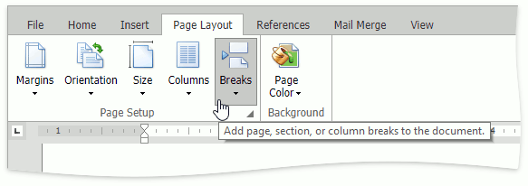
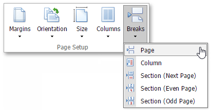

# Insert a Page Break
## Insert Page Break
You can insert a page break in your document anywhere you want. To do this, follow the steps below.
1. Point to the position within a document where you want to insert a page break.
2. Click the **Breaks** button in the **Page Setup** group in the **Page Layout** tab.
	
	
	
	Select the **Page** item in the opened drop-down list.
	
	
	
	Or press **CTRL+ENTER**.

To show the page break mark, press **CTRL+SHIFT+8** or click the  button in the **Paragraph** group in the **Home** tab.

In a document, page breaks are marked as illustrated below.

## Keyboard Shortcuts to Insert Breaks
You can use the following keyboard shortcuts to insert breaks of different types.

|  |  |
|---|---|
| CTRL+SHIFT+ENTER | Inserts a [column break](../document-layout-and-page-setup/lay-out-text-in-columns.md) in a document. |
| CTRL+ENTER | Inserts a page break. |
| ENTER | Inserts a paragraph break. |
| SHIFT+ENTER | Inserts a line break. |
| TAB | Inserts a tab |