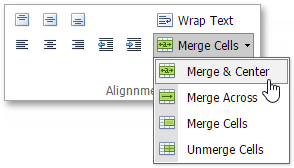

# Wrap Text and Merge Cells
If text is too long to be displayed in a single cell, the **Spreadsheet** allows you to wrap the text to make it display on multiple lines in the cell, or merge cells to combine two or more adjacent cells into a single larger/longer cell.

## Merging Cells
To merge cells, follow the instructions below.
1. [Select](../editing-cells/select-cells-or-cell-content.md) the cells that you wish to merge.
	
	> Make sure that the data you wish to display in the merged cell is contained in the upper-left cell of the selected range, because only the contents of this cell will remain in the merged cell. The data in the other cells will be deleted.
2. In the **Alignment** group within the **Home** tab, click the **Merge Cells** button's drop-down arrow and select one of the following items.
	* **Merge &amp; Center** - merge the selected cells and center the text in a merged cell.
	* **Merge Across** - merge each row of the selected cell range into larger cells.
	* **Merge Cells** - merge the selected cells into a single cell.
	
	
3. If you change your mind and wish to split a merged cell, select this cell and click the **Unmerge Cells** item in the **Merge Cells** button's drop-down menu. The data of the merged cell appears in the upper-left cell of the range of split cells.

## Wrapping Text in a Cell
To wrap text in a cell, do the following.
1. [Select](../editing-cells/select-cells-or-cell-content.md) a cell or a range of cells containing the text you wish to wrap.
2. In the **Alignment** group within the **Home** tab, click the **Wrap Text** button. The text is displayed on multiple lines within the cell.
	
	
3. To unwrap the text, click the **Wrap Text** button again. The text is displayed in the same way as it was before the wrap option was applied.